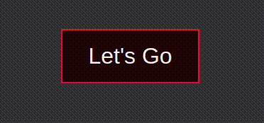

# CSS Animations
## Two Ways
### 1. Transitions
### 2. Animations

## 1. Transitions

- Transitions wait until the change in a property occurs and then allows changes to take place over time.
- Without a transition any changes in a property will take effect immediately.
- Transitions should be used when properties are changed interactively
	- Ex: Hovering and Focusing

## 2. Animations
- Animations however provide keyframes for more control over the animation and allows us to create complex animations on a frame by frame basis.
- Use animations when you want to create complex animations that just work without having to wait for properties that change interactively.
- We can create stunning animations by combining both transitions and animations together.

## Transitions in Detail
- To create a transition, we first need a component that has change in property.
- So, I have a button, it has some styles and a hover state.
- When we hover over the button, we see that it happens immediately.
  ```html
	  <button>Let's Go</button>
	```

	```css
	button{
	  padding:18px 36px;
	  font-size:2rem;
	  background:#220011;
	  outline:none;
	  color:#f2f2f8;
	  border:2px solid #EE0044;
	  cursor:pointer;
	}

	button:hover{
	  transform:translateY(-10px)
	}
	```
	
	
  
- We can make the hover state happen over time by transition properties.
	- `transition-property`: It defines which property the transition effect should apply to.
	- `transition-duration`: It defines how long the transition effect should take to complete.
	- `transition-timing-function`: It defines the acceleration curve for the transition. Common values: `ease`(default), `ease-in`,`ease-out`,`ease-in-out`,`linear`
	- `transition-delay`:It defines the delay before the transition should take effect
  ```css
    button{
	  padding:18px 36px;
	  font-size:2rem;
	  background:#220011;
	  outline:none;
	  color:#f2f2f8;
	  border:2px solid #EE0044;
	  cursor:pointer;
	  transition-property:transform;
	  transition-duration:0.5s;
	  transition-timing-function:ease;
	  transition-delay:0s;
	}

	button:hover{
	  transform:translateY(-10px)
	}  
	```
	- Here, we apply transition on our transform property and duration is 0.5s which means the hovering happens over a span of 0.5 seconds and not immediately, delay is 0 as we want the transition to happen as soon as we hover over the button.

     
     
	- And if we apply 1s delay, then the transition starts when we hover over the button for 1s
	  ```css
		button{
		  padding:18px 36px;
		  font-size:2rem;
		  background:#220011;
		  outline:none;
		  color:#f2f2f8;
		  border:2px solid #EE0044;
		  cursor:pointer;
		  transition-property:transform;
		  transition-duration:0.5s;
		  transition-timing-function:ease;
		  transition-delay:1s;
		}

		button:hover{
		  transform:translateY(-10px);
		}
		```
	  
	  
	  	  
	- We can apply transition on multiple properties like this. For ex: change in `transform`,`background-color` and `color`.
	  ```css
	    button{
		  padding:18px 36px;
		  font-size:2rem;
		  background:#220011;
		  outline:none;
		  color:#f2f2f8;
		  border:2px solid #EE0044;
		  cursor:pointer;
		  transition-property:transform background-color color;
		  transition-duration:0.5s;
		  transition-timing-function:ease;
		  transition-delay:0s;
		}
		
		button:hover{
		  transform:translateY(-10px);
		  background-color:#f2f2f8;
		  color:#EE0044;
		}
		```
	  
	  
	- `transition` shorthand: Instead of writing all these transition properties separately, we can use the shorthand property.
		- single property
			- `transition`:`<property> <duration> <timing-function> <delay>`
			 ```css
					button{
					  padding:18px 36px;
					  font-size:2rem;
					  background:#220011;
					  outline:none;
					  color:#f2f2f8;
					  border:2px solid #EE0044;
					  cursor:pointer;
					  transition:transform 0.5s ease 0s;
					}
					
					button:hover{
					  transform:translateY(-10px);
					}	
			```

		- We can also omit the transition properties if we are using default values.

			 ```css
				 button{
				  padding:18px 36px;
				  font-size:2rem;
				  background:#220011;
				  outline:none;
				  color:#f2f2f8;
				  border:2px solid #EE0044;
				  cursor:pointer;
				  /* works same as transition: transform 0.5s ease-in 0s*/
				  transition:transform 0.5s; 
				}
				
				button:hover{
				  transform:translateY(-10px);
				}
			   ```
		- multiple properties(comma separated)
			- `transition`:`<property> <duration> <timing-function> <delay>, property> <duration> <timing-function> <delay>, property> <duration> <timing-function> <delay>`
			 ```css
				 button{
				  padding:18px 36px;
				  font-size:2rem;
				  background:#220011;
				  outline:none;
				  color:#f2f2f8;
				  border:2px solid #EE0044;
				  cursor:pointer;
				  transition:transform 0.5s, background-color 0.7s linear, color    0.1s ease-out; 
				}
				
				button:hover{
				  transform:translateY(-10px);
				  background-color:#f2f2f8;
				  color:#EE0044;
				}
			   ```
		- all properties
			- `transition`:`all <duration> <timing-function> <delay>`
			```css
			button{
			  padding:18px 36px;
			  font-size:2rem;
			  background:#220011;
			  outline:none;
			  color:#f2f2f8;
			  border:2px solid #EE0044;
			  cursor:pointer;
			  transition:all 0.3s linear;
			}
			
			button:hover{
			  transform:translateY(-10px);
			  background-color:#f2f2f8;
			  color:#EE0044;
			}
		   ```

## Animations in Detail
- First we need an element that we need to animate.
  ```html
  <h1 class="heading-1">Let's explore the world</h1>
	```

- To animate this heading, we need to add a keyframe.
	- Syntax: `@keyframes nameOfAnimation{}`