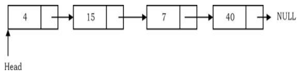

# Linked List

## What is a Linked List?
- It is a data structure used for storing collections of data.
- But arrays are also use for storing collections of data. Then what's the difference?
## Arrays - Advantages and Disadvantages
| **Aspect**              | **Advantages**                                                                                     | **Disadvantages**                                                                                      |
| ----------------------- | -------------------------------------------------------------------------------------------------- | ------------------------------------------------------------------------------------------------------ |
| **Memory Allocation**   | Fixed size, which simplifies memory management.                                                    | Fixed size can lead to wasted memory if the array is underutilized or overflow if overutilized.        |
| **Access Time**         | Constant time `O(1)` access to elements using an index.                                            | No direct way to access elements by value, requiring a linear search `O(n)`.                           |
| **Iteration**           | Easy to iterate through elements using loops due to contiguous memory.                             | Iterating over large arrays can be time-consuming.                                                     |
| **Cache Friendliness**  | Contiguous memory allocation improves cache performance, leading to faster access speeds.          | Large arrays may not fit entirely in cache, leading to cache misses and slower performance.            |
| **Insertion/Deletion**  | Efficient when adding/removing elements at the end (`O(1)`).                                       | Inefficient for adding/removing elements at the beginning or middle (`O(n)`), requiring shifts.        |
| **Memory Wastage**      | Low memory overhead, since arrays don't require extra storage for pointers or metadata.            | Fixed size can result in wasted memory if the array isn't fully utilized.                              |
| **Predictability**      | Predictable performance characteristics due to constant time access and fixed memory allocation.   | Lack of flexibility, as the array size cannot be changed once allocated.                               |
| **Usage in Algorithms** | Arrays are simple and well-suited for low-level programming and performance-critical applications. | Less flexible compared to dynamic data structures like linked lists or dynamic arrays (e.g., vectors). |
## Linked List - Advantages and Disadvantages
| **Aspect**              | **Advantages**                                                                                           | **Disadvantages**                                                                                    |
| ----------------------- | -------------------------------------------------------------------------------------------------------- | ---------------------------------------------------------------------------------------------------- |
| **Memory Allocation**   | Dynamic size; can grow or shrink as needed without waste.                                                | Requires extra memory for storing pointers in each node.                                             |
| **Insertion/Deletion**  | Efficient insertion/deletion at the beginning or middle (`O(1)` if the position is known).               | Inefficient for accessing elements by index (`O(n)`), as traversal is needed.                        |
| **Memory Utilization**  | No need to pre-allocate memory, reducing waste and avoiding overflow issues.                             | Fragmented memory usage can lead to poor cache performance.                                          |
| **Flexibility**         | Easier to implement data structures like stacks, queues, and more complex structures like trees.         | Difficult to implement with random access, making certain algorithms less efficient.                 |
| **No Wasted Space**     | No need to allocate a large contiguous block of memory, which is useful for systems with limited memory. | More complex memory management due to pointers, which can lead to errors like memory leaks.          |
| **Cache Performance**   | Can efficiently handle frequent insertions and deletions, especially in large datasets.                  | Poor cache locality due to non-contiguous memory allocation, leading to slower access times.         |
| **Simplicity**          | Simpler than dynamic arrays (e.g., vectors) in terms of memory reallocation logic.                       | Increased complexity in implementation, especially for operations like reversing or sorting.         |
| **Usage in Algorithms** | Preferred for implementing dynamic data structures where frequent insertions and deletions occur.        | Less efficient for algorithms requiring frequent access to elements by index, such as binary search. |
## Arrays vs Linked Lists vs Dynamic Arrays
| **Parameter**                       | **Linked List**       | **Array**                                                | **Dynamic Array**                                        |
| ----------------------------------- | --------------------- | -------------------------------------------------------- | -------------------------------------------------------- |
| **Indexing**                        | `O(n)`                | `O(1)`                                                   | `O(1)`                                                   |
| **Insertion/Deletion at Beginning** | `O(1)`                | `O(n)`, if array is not full (for shifting the elements) | `O(n)`                                                   |
| **Insertion at Ending**             | `O(n)`                | `O(1)`, if array is not full                             | `O(1)`, if array is not full `O(n)`, if array is full |
| **Deletion at Ending**              | `O(n)`                | `O(1)`                                                   | `O(1)`                                                   |
| **Insertion in Middle**             | `O(n)`                | `O(n)`, if array is not full (for shifting the elements) | `O(n)`                                                   |
| **Deletion in Middle**              | `O(n)`                | `O(n)`, if array is not full (for shifting the elements) | `O(n)`                                                   |
| **Wasted Space**                    | `O(n)` (for pointers) | `0`                                                      | `O(n)`                                                   |
## Singly Linked List
- A singly linked list is a linear data structure composed of a sequence of nodes. Each node contains two key elements:
	1. **Data**: The value or data the node holds.
	2. **Next Pointer**: A reference to the next node in the sequence.

	The list starts with a special node called the **HEAD**, which points to the first node in the list. Each node's next pointer directs to the subsequent node, forming a chain. The last node in this chain has its next pointer set to `NULL`, signifying the end of the list.

	In simpler terms, the HEAD provides access to the linked list, and the nodes are connected one after another, with the final node marking the list's end with a `NULL` link.
	
### Insertion in Singly Linked List
- ***Insertion at the beginning***
	- Create new node
	- Update the pointer of new node, to point to the current HEAD
	 
	- Update HEAD pointer to point to the new node.
	 
- ***Insertion at the Ending***
	- Create new node
	- The new node points to NULL.
	 
	- Last node's next pointer points to the new node
	 
- ***Insertion at a given position***
	- If we want to add an element at position 3 then we stop at position 2. That means we traverse 2 nodes and insert the new node. For simplicity let us assume that the second node is called _position_ node. The new node points to the next node of the position where we want to add this node.
	 
	- Position node’s next pointer now points to the new node.
	 
## Deletion in Singly Linked List
- ***Deleting***