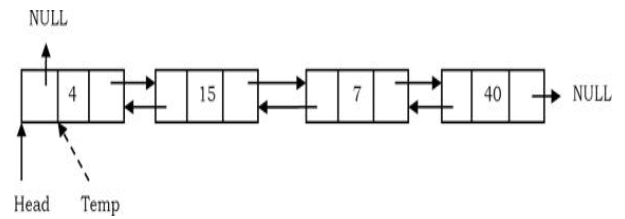
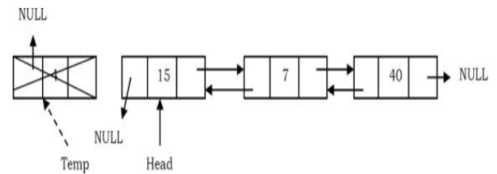
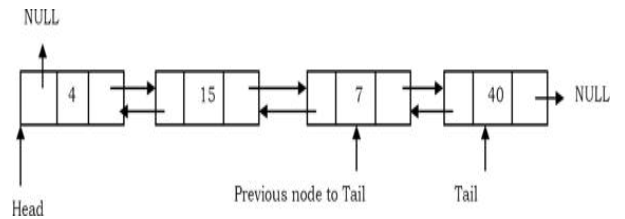
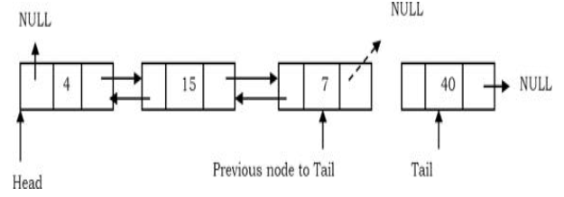
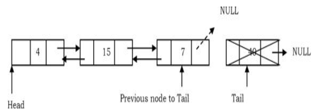
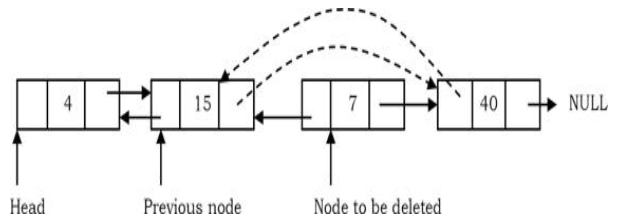
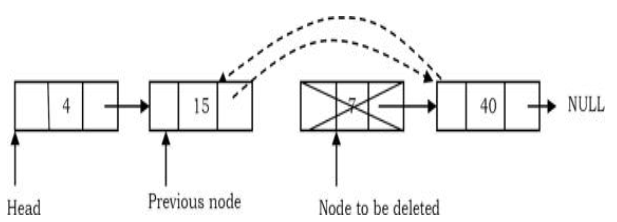

# Doubly Linked List
## What is a doubly linked list?
-  A doubly linked list is a linear data structure composed of a sequence of nodes. Each node contains three key elements:

	1. **Data**: The value or data the node holds.
	2. **Next Pointer**: A reference to the next node in the sequence.
	3. **Previous Pointer**: A reference to the previous node in the sequence.
- The list starts with a special node called the **HEAD**, which points to the first node in the list. Each node's next pointer directs to the subsequent node, while the previous pointer directs to the preceding node, allowing traversal in both directions. The last node in this chain, called the **TAIL**, has its next pointer set to `NULL`, signifying the end of the list, and its previous pointer points to the preceding node.
- In simpler terms, the HEAD provides access to the linked list, and the nodes are connected both forward and backward, with the final node marking the list's end with a `NULL` link in the next pointer and a reference to the previous node in the sequence.

  
   

### Traversing in Doubly Linked List
- Start from the head of the list.
- Follow the `next` pointers, visiting each node. 
- Display the contents of the nodes (or count) as they are traversed. 
- Stop when the `next` pointer points to `NULL`.
- **Time Complexity**: O(n) for scanning the list of size `n` 
- **Space Complexity**: O(1) for the temporary variable used to track the current node
### Inserting in Doubly Linked List
- ***Insert a node at the beginning***
	-  New node is inserted before the head node. Previous and next pointers need to be modified and it can be done in two steps:
		- Update the right pointer of the new node to point to the current head node (dotted link in below figure) and also make left pointer of new node as NULL.
		  
		- Update head node’s left pointer to point to the new node and make new node as head.
		  
		- **TIME COMPLEXITY**: O(1)  - Inserting a node at the beginning only involves updating the pointers of the head and the new node, which takes constant time.
		- **SPACE COMPLEXITY**: O(1) - No extra space is required other than the new node itself, so the space complexity is constant.
- ***Insert a node at the Ending***
	- In this case, traverse the list till the end and insert the new node.
		- New node’s right pointer points to NULL and left pointer points to the end of the list.
		  
		- Update right pointer of last node to point to new node.
		  
		- **TIME COMPLEXITY**: O(n) - To insert a node at the end, you need to traverse the entire list, which takes O(n) time, where n is the number of nodes in the list.
		- **SPACE COMPLEXITY**: O(1) - Only constant space is required for the new node, so the space complexity remains O(1).
- ***Insert a node at given position***
	-  Traverse the list to the position node and insert the new node.
		- _New node_ right pointer points to the next node of the _position node_ where we want to insert the new node. Also, _new node_ left pointer points to the _position node_.
		  
		- Position node right pointer points to the new node and the _next node_ of position node left pointer points to new node.
		  
		- **TIME COMPLEXITY**: - O(n) - The worst-case scenario occurs when you need to insert the node towards the end of the list, which requires traversing the list up to that position, taking O(n) time.
		- **SPACE COMPLEXITY**: O(1) - As with the other insertion operations, only constant space is needed for the new node, so the space complexity is O(1).
### Deleting in Doubly Linked List
- ***Deleting the First Node***
	- In this case, the first node (current head node) is removed from the list. It can be done in two steps:
		- Create a temporary node which will point to the same node as that of head.
		  
		- Now, move the head nodes pointer to the next node and change the heads left pointer to NULL and dispose of the temporary node.
		  !
		- **TIME COMPLEXITY**: O(1) - Deleting the first node only involves updating the head pointer and disposing of the node, which takes constant time.
		- **SPACE COMPLEXITY**: O(1) -  No additional space is needed aside from the existing nodes, so the space complexity is constant.
- ***Deleting the Last Node***
	- This operation is a bit trickier than removing the first node, because the algorithm should find a node, which is previous to the tail first. This can be done in three steps:
		- Traverse the list and while traversing maintain the previous node address also. By the time we reach the end of the list, we will have two pointers, one pointing to the tail and the other pointing to the node before the tail.
		  
		- Update the next pointer of previous node to the tail node with NULL.
		  
		- Dispose of the tail node.
		  
		- **TIME COMPLEXITY**: O(n) - To delete the last node, you need to traverse the list to find the previous node to the tail, which takes O(n) time.
		- **SPACE COMPLEXITY**: O(1) - The operation requires constant space, as it only involves disposing of the last node.
- ***Deleting an Intermediate Node***
	- In this case, the node to be removed is _always located between_ two nodes, and the head and tail links are not updated. The removal can be done in two steps:
		- Similar to the previous case, maintain the previous node while also traversing the list. Upon locating the node to be deleted, change the previous node’s next pointer to the next node of the node to be deleted.
		  
		- Dispose of the current node to be deleted.
		  
		- **TIME COMPLEXITY**: O(n) - The time complexity is O(n) because you may need to traverse up to the middle of the list to locate the node to be deleted.
		- **SPACE COMPLEXITY**: - O(1) - Only constant space is needed to hold references to the current and previous nodes, so the space complexity is O(1).
- ***Deleting a Doubly Linked List*** 
	- Start from the head of the list. 
	- Use a temporary variable to store the current node. 
	- Free the current node. - Move to the next node using the `next` pointer and repeat the process until all nodes are freed.
	- **Time Complexity**: O(n) You need to traverse the entire list, freeing each node one by one.
	- **Space Complexity**: O(1) The space required is constant, as no additional space is needed aside from the temporary variable used for traversal.