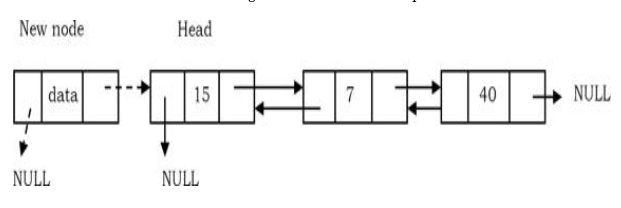

# Doubly Linked List
## What is a doubly linked list?
-  A doubly linked list is a linear data structure composed of a sequence of nodes. Each node contains three key elements:

	1. **Data**: The value or data the node holds.
	2. **Next Pointer**: A reference to the next node in the sequence.
	3. **Previous Pointer**: A reference to the previous node in the sequence.
- The list starts with a special node called the **HEAD**, which points to the first node in the list. Each node's next pointer directs to the subsequent node, while the previous pointer directs to the preceding node, allowing traversal in both directions. The last node in this chain, called the **TAIL**, has its next pointer set to `NULL`, signifying the end of the list, and its previous pointer points to the preceding node.
- In simpler terms, the HEAD provides access to the linked list, and the nodes are connected both forward and backward, with the final node marking the list's end with a `NULL` link in the next pointer and a reference to the previous node in the sequence.

  
   

### Inserting in Doubly Linked List
- ***Insert a node at the beginning***
	-  New node is inserted before the head node. Previous and next pointers need to be modified and it can be done in two steps:
		- Update the right pointer of the new node to point to the current head node (dotted link in below figure) and also make left pointer of new node as NULL.
		  
		- Update head node’s left pointer to point to the new node and make new node as head.
		  
		- **TIME COMPLEXITY**:
		- **SPACE COMPLEXITY**:
- ***Insert a node at the Ending***
	- In this case, traverse the list till the end and insert the new node.
		- New node’s right pointer points to NULL and left pointer points to the end of the list.
		  
		- Update right pointer of last node to point to new node.
		  
		- **TIME COMPLEXITY**:
		- **SPACE COMPLEXITY**:
- ***Insert a node at given position***
	-  Traverse the list to the position node and insert the new node.
		- _New node_ right pointer points to the next node of the _position node_ where we want to insert the new node. Also, _new node_ left pointer points to the _position node_.
		  
		- Position node right pointer points to the new node and the _next node_ of position node left pointer points to new node.
		  
		- **TIME COMPLEXITY**:
		- **SPACE COMPLEXITY**:

### Deleting in Doubly Linked List
- ***Deleting the First Node***
	- In this case, the first node (current head node) is removed from the list. It can be done in two steps:
		- Create a temporary node which will point to the same node as that of head.
		  ![[Pasted image 20240825121011.png]]
		- 
- ***Deleting the Last Node***
- ***Deleting an Intermediate Node***