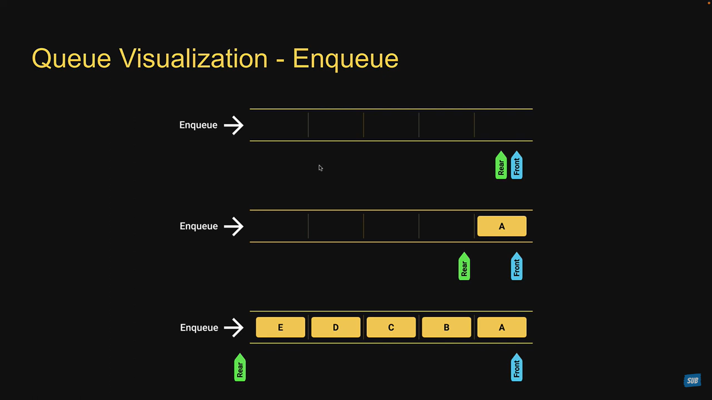
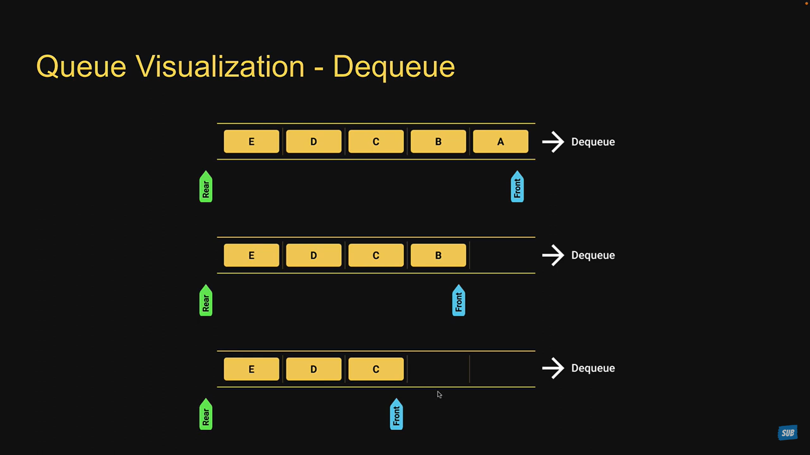
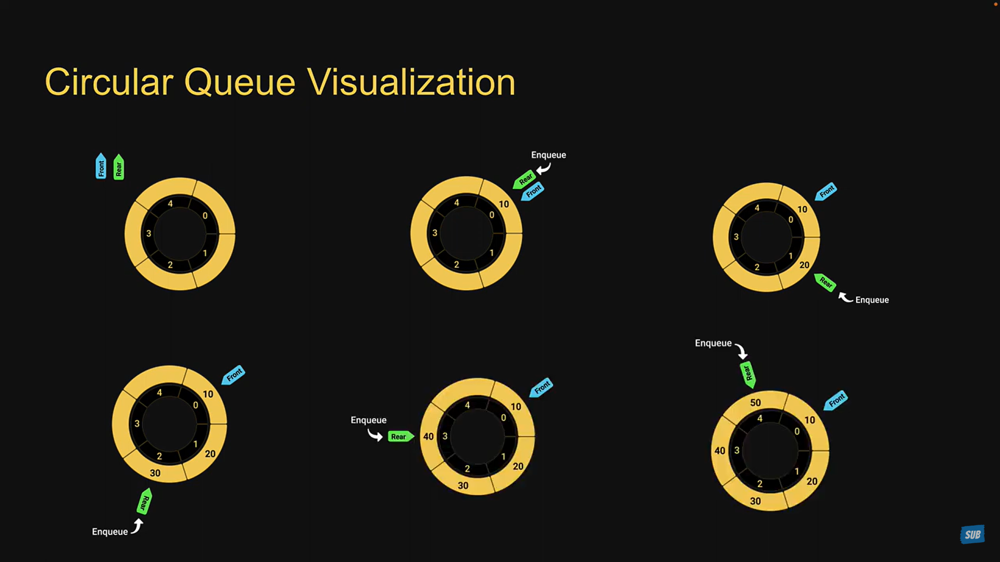
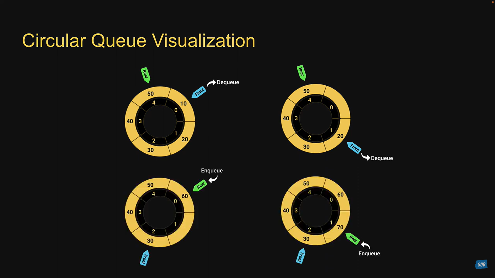

# Queue

## What is a Queue?

- The queue data structure is a sequential collection of elements that follows the principle of First In First Out(FIFO)
- The first element inserted into the queue is first element to be removed.
- A queue of people. People enter the queue at one end(rear/tail) and leave the queue from the other end (front/head).
- Queue is an abstract data type. It is defined by its behavior rather than being a mathematical model.
- The queue data structure supports two main operations
  - ***Enqueue***: It ads an element to the rear/tail of the collection.
  - ***Dequeue***: It removes and element from the front/head of the collection.

### Queue Visualization - ENQUEUE


### Queue Visualization - DEQUEUE


### Queue Usage

- Printers.
- CPU task scheduling.
- Callback queue in JS runtime.

### Queue Implementation
- ***enqueue(element)***: Add an element to the queue.
- ***dequeue***: remove the oldest element from the queue.
- ***peek()***: get the value of the element at the front of the queue without removing it.
- ***isEmpty()***:Check if the queue is empty.
- ***size()***:Get the number of elements in the queue.
- ***print()***: Visualize the elements in a queue.

## Circular Queue

### What is a circular queue?
- The size of the queue is fixed and a single block of memory is used as if the first element is connected to the last element.
- Also referred to as circular buffer or ring buffer and follows the FIFO principle.
- A circular queue will reuse the empty block created during the dequeue operation
- When working with queues of fixed maximum size, a circular queue is a great implementation choice.
- The circular queue data structure supports two main operations:
  - ***Enqueue***:- It adds an element to the rear/tail of the collection.
  - ***Dequeue***:- It removes and element from the front/head of the collection.

### Circular Queue Visualization




### Circular Queue Usage
- Clock
- Streaming Data
- Traffic Lights

JAVA
```java
class Queue {
    private int[] items;
    private int front, rear, capacity, size;

    public Queue(int capacity) {
        this.capacity = capacity;
        this.items = new int[capacity];
        this.front = 0;
        this.rear = -1;
        this.size = 0;
    }

    public void enqueue(int element) {
        if (size == capacity) {
            System.out.println("Queue is full");
            return;
        }
        rear = (rear + 1) % capacity; // Circular increment
        items[rear] = element;
        size++;
    }

    public Integer dequeue() {
        if (isEmpty()) {
            return null;
        }
        int item = items[front];
        front = (front + 1) % capacity; // Circular increment
        size--;
        return item;
    }

    public boolean isEmpty() {
        return size == 0;
    }

    public Integer peek() {
        if (isEmpty()) {
            return null;
        }
        return items[front];
    }

    public int size() {
        return size;
    }

    public void print() {
        if (isEmpty()) {
            System.out.println("Queue is empty");
            return;
        }
        for (int i = 0; i < size; i++) {
            System.out.print(items[(front + i) % capacity] + " ");
        }
        System.out.println();
    }

    public static void main(String[] args) {
        Queue queue = new Queue(5); // Set capacity to 5
        System.out.println("Is the queue empty: " + queue.isEmpty());

        queue.enqueue(15);
        queue.enqueue(30);
        queue.enqueue(45);

        System.out.println("After inserting");
        System.out.println("Is the queue empty: " + queue.isEmpty());
        System.out.println("Size of queue: " + queue.size());
        queue.print();
        System.out.println("First Element: " + queue.peek());

        queue.dequeue();

        System.out.println("After deleting");
        System.out.println("Size of queue: " + queue.size());
        queue.print();
        System.out.println("First Element: " + queue.peek());
    }
}
```

```explanation
The Queue class uses an array to manage elements in a circular manner. Here's a breakdown of the main methods and how they work with an example.

Example Scenario
We will use the following sequence of operations:

Enqueue 15
Enqueue 30
Enqueue 45
Dequeue (remove one element)
We’ll start with an empty queue and perform the operations in sequence.

Initial Setup
When you create a queue with a capacity of 5:

java
Copy code
Queue queue = new Queue(5);
State:
items: [0, 0, 0, 0, 0] (initially filled with zeros)
front: 0
rear: -1
size: 0
Step 1: Enqueue 15
java
Copy code
queue.enqueue(15);
Operation:

Check if the queue is full (it’s not).
Increment rear: (rear + 1) % capacity → (0 + 1) % 5 → 0.
Place 15 in items[0].
Increment size to 1.
State:

items: [15, 0, 0, 0, 0]
front: 0
rear: 0
size: 1
Step 2: Enqueue 30
java
Copy code
queue.enqueue(30);
Operation:

Check if the queue is full (it’s not).
Increment rear: (0 + 1) % 5 → 1.
Place 30 in items[1].
Increment size to 2.
State:

items: [15, 30, 0, 0, 0]
front: 0
rear: 1
size: 2
Step 3: Enqueue 45
java
Copy code
queue.enqueue(45);
Operation:

Check if the queue is full (it’s not).
Increment rear: (1 + 1) % 5 → 2.
Place 45 in items[2].
Increment size to 3.
State:

items: [15, 30, 45, 0, 0]
front: 0
rear: 2
size: 3
Checking Queue State
Now we check the queue status:

Is Empty: false
Size: 3
First Element: 15 (using peek).
Step 4: Dequeue
java
Copy code
queue.dequeue();
Operation:

Check if the queue is empty (it’s not).
Store the item at front: items[0] (which is 15).
Increment front: (0 + 1) % 5 → 1.
Decrement size to 2.
Return the removed element (15).
State:

items: [15, 30, 45, 0, 0] (15 is still in the array, but no longer accessible through the queue)
front: 1
rear: 2
size: 2
Final Queue State
After the dequeue operation:

Is Empty: false
Size: 2
First Element: 30 (new front).
Summary
This code effectively manages a queue using an array with a circular approach to handle operations efficiently without shifting elements. The capacity is fixed, and the queue can grow and shrink in size while maintaining the order of elements.

Feel free to ask if you need more details on any specific part!
```