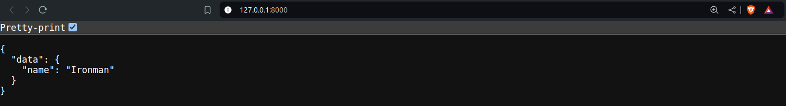
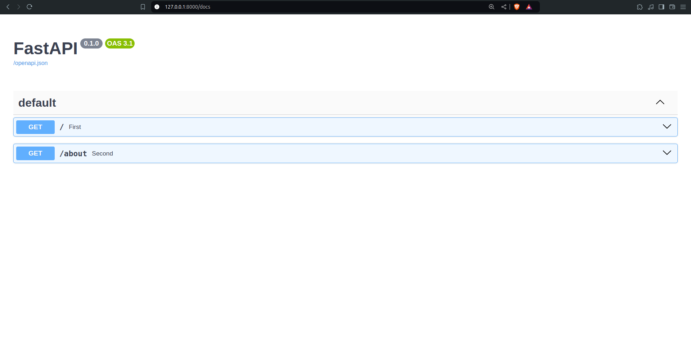
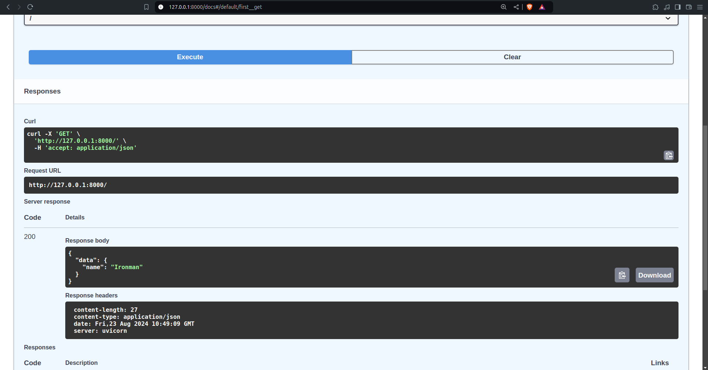
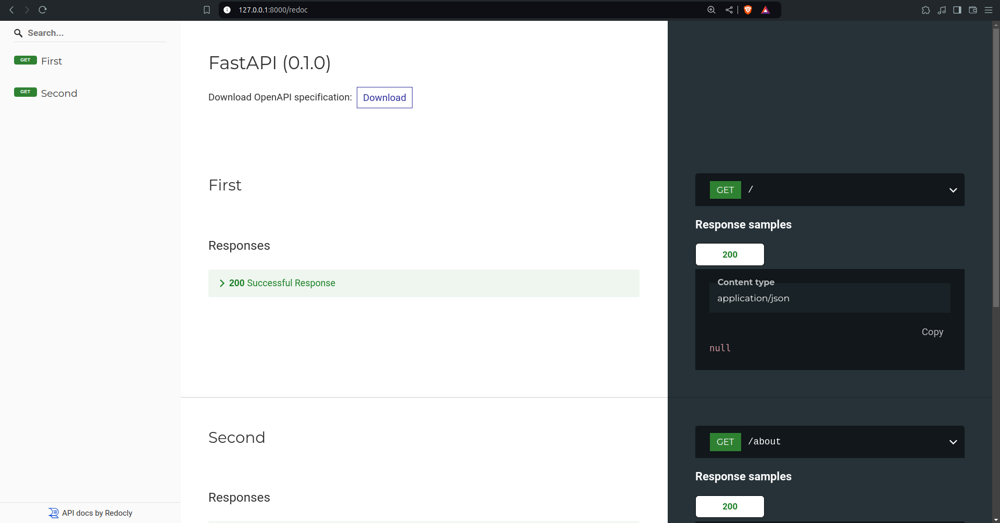

## Create a virtual environment
- `mkdir awesome-project`
- `cd awesome-project`
- Create a virtual env
	- `python3 -m venv .venv`
		- `.venv` - This name can be any other name but this is the convention.
		- You only need to do this **once per project**, not every time you work.
- Activate the virtual environment
	- `source .venv/bin/activate`
	- Do this **every time** you start a **new terminal session** to work on the project.
	- Every time you install a **new package** in that environment, **activate** the environment again.
- Check if the Virtual Environment is Active
	- `which python`
	- Output should be: "../../../../awesome-project/.venv/bin/python"
- Upgrade Pip
	- `python3 -m pip install --upgrade pip`
- Add gitignore
	- `echo "*" > .venv/.gitignore`
		-  Create .venv/.gitignore and write * in that.

## Install fastapi
- Install package directly
	- `pip install "fastapi[standard]`
- Install from `requirements.txt`
	- `pip install -r requirements.txt`
## Basic Setup
- Create a file named `main.py` or any other name in the root directory of the project.
- Write the following code:
```python
from fastapi import FastAPI

app = FastAPI()

  
@app.get("/")

def first():

	return {"data":{"name":"Ironman"}}

  
@app.get("/about")

def second():

	return {"data":{"tagline":"I am Iron Man"}}
```
- You can then run the server using one of the following commands:
	- `fastapi dev main.py` - We can open the browser and go to : `http://127.0.0.1:8000/`
	- `uvicorn main:app --reload` - It will run on `http://127.0.0.1:8000/`
	- `uvicorn main:app --port 4000 --reload` - Changed Port - It will run on `http://127.0.0.1:4000/`
- Output
  
- API DOCS
	- Now go to `http://127.0.0.1:8000/docs`
		- We will see an interactive API documentation automatically generated.
		  
		- Then click on the "Execute" button, the user interface will communicate with your API, send the parameters, get the results and show them on the screen
			
	- Another doc `http://127.0.0.1:8000/redoc`
		 
## Dependencies
- Fast api depends on
	- Pydantic
	- Starlette
- `standard` Dependencies
	- When you install FastAPI with `pip install "fastapi[standard]"` it comes the `standard` group of optional dependencies:
	- Used by Pydantic:
		- [`email-validator`](https://github.com/JoshData/python-email-validator) - for email validation.
	- Used by Starlette:
		- [`httpx`](https://www.python-httpx.org/) - Required if you want to use the `TestClient`.
		- [`jinja2`](https://jinja.palletsprojects.com/) - Required if you want to use the default template configuration.
		- [`python-multipart`](https://github.com/Kludex/python-multipart) - Required if you want to support form "parsing", with `request.form()`.
- Used by FastAPI / Starlette:
	- [`uvicorn`](https://www.uvicorn.org/) - for the server that loads and serves your application. This includes `uvicorn[standard]`, which includes some dependencies (e.g. `uvloop`) needed for high performance serving.
	- `fastapi-cli` - to provide the `fastapi` command.
- Without `standard` Dependencies
	- If you don't want to include the `standard` optional dependencies, you can install with `pip install fastapi` instead of `pip install "fastapi[standard]"`.
- Additional Optional Dependencies
	- There are some additional dependencies you might want to install.
	- Additional optional Pydantic dependencies:
		- [`pydantic-settings`](https://docs.pydantic.dev/latest/usage/pydantic_settings/) - for settings management.
		- [`pydantic-extra-types`](https://docs.pydantic.dev/latest/usage/types/extra_types/extra_types/) - for extra types to be used with Pydantic.
	- Additional optional FastAPI dependencies:	
		- [`orjson`](https://github.com/ijl/orjson) - Required if you want to use `ORJSONResponse`.
		- [`ujson`](https://github.com/esnme/ultrajson) - Required if you want to use `UJSONResponse`.