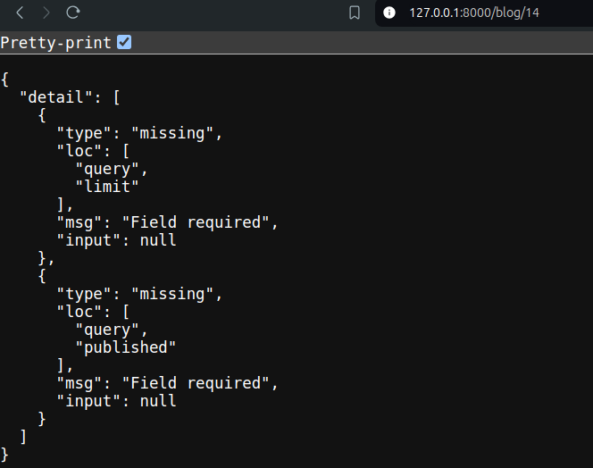
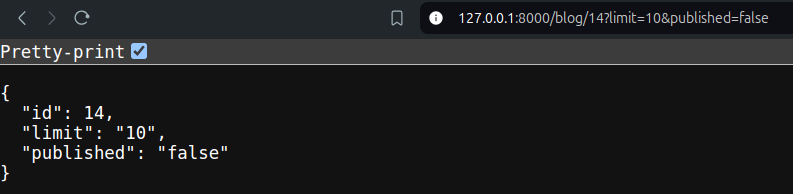
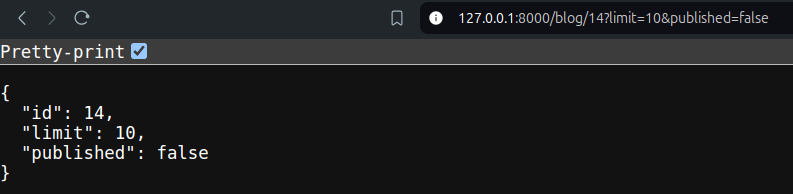
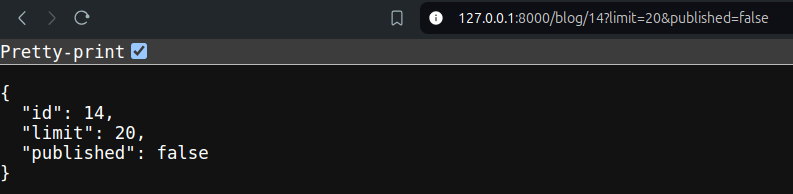
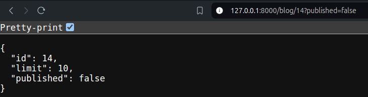

### 1. **Fetching All Blogs:**

- When fetching all blogs, pulling thousands of records (e.g., 10,000) at once is highly inefficient.
- Instead, it's better to limit the number of results and filter for specific criteria like whether the blog is published.
### 2. **Query Parameters:**

- Query parameters are a way to refine your API requests. They are added to the URL after a question mark `?`, followed by `name=value` pairs.
- Example: `/blogs?limit=10&published=true`.
### 3. **Handling Query Parameters in FastAPI:**

- **Path Parameters:** These are part of the URL path, e.g., `/blogs/{id}`.
- **Query Parameters:** These are passed in the URL after the path, e.g., `/blogs?limit=10`.
- To handle query parameters:
    - Accept them in your function similar to path parameters.
    - Use them to modify your database query.
- *When you declare other function parameters that are not part of the path parameters, they are automatically interpreted as "query" parameters.*
### 4. Examples
- **Defining Query Parameters (Simplest)**
	```python
		@app.get("/blog/{id}")
		def show(id:int,limit,published):
			return {"id":id,"limit":limit,"published":published}
	```

	- When we go to the URL (Not specifying the query parameters): `http://127.0.0.1:8000/blog/14`
	- Output:
	  
	  - It shows error as in the function we have defined query parameters, but in the URL we are not sending any.
	  - So by default the query parameters are required.
	  - When we go to the URL (Specifying the query parameters): `http://127.0.0.1:8000/blog/14?limit=10&published=false`
	  - Output:
		 
		- *If we omit either of the two parameters, there will be an error as both are required.*
		- One thing to notice in `{"published":"false"}` is that false is a string and similarly limit is a string also. So, if we try to do any condition check using it, then it will not produce the desired result. So it is always good to specify the data type.
	
	- **Defining Query Parameters(With specified data type)**
	  ```python
	  @app.get("/blog/{id}")
	  def show(id:int,limit:int,published:bool):
		return {"id":id,"limit":limit,"published":published}
		```
	- When we go to the URL (Specifying the query parameters): `http://127.0.0.1:8000/blog/14?limit=10&published=false`
	 
	- Now limit is an integer and published is a boolean.

- **Defining Query Parameters (With Default Value)**
	- If a query parameter is not provided, a default value can be set.
	- Let's try to give a default value to limit and leave everything as it is.
	 ```python
	 @app.get("/blog/{id}")
	 def show(id:int,limit:int=10,published:bool):
		return {"id":id,"limit":limit,"published":published}
		```
	- This will give us error right inside our IDE:*Non-default argument follows default argument* : which essentially means that we need to define arguments with default values after the non-default arguments.
	- The best thing is: *The order of queries you provide in the URL doesn't have to match with the order of arguments of the function as query parameters are identified by their name and not their position*
		```python
	 @app.get("/blog/{id}")
	 def show(id:int,published:bool,limit:int=10):
		return {"id":id,"limit":limit,"published":published}
		```
	- So, by simply doing the above, the code will work fine.
	- When we go to the URL (Specifying the query parameters): `http://127.0.0.1:8000/blog/14?limit=20&published=false`
	
	- And if we don't specify `limit` parameter in the URL, it will take the default value 10.
	
	- But if we don't specify the `published` parameter, it is going to result in an error as we haven't provided any default value to it and it is required.
	- So, we can specify default value for both:
	 ```python
	 @app.get("/blog/{id}")
	 def show(id:int,published:bool=False,limit:int=10):
		return {"id":id,"limit":limit,"published":published}
	   ```
	- Now, if we don't specify any query parameter in the URL, it is going to take the default values.

- **Defining Query Parameters (With Optional Value)**
  ```python
	```