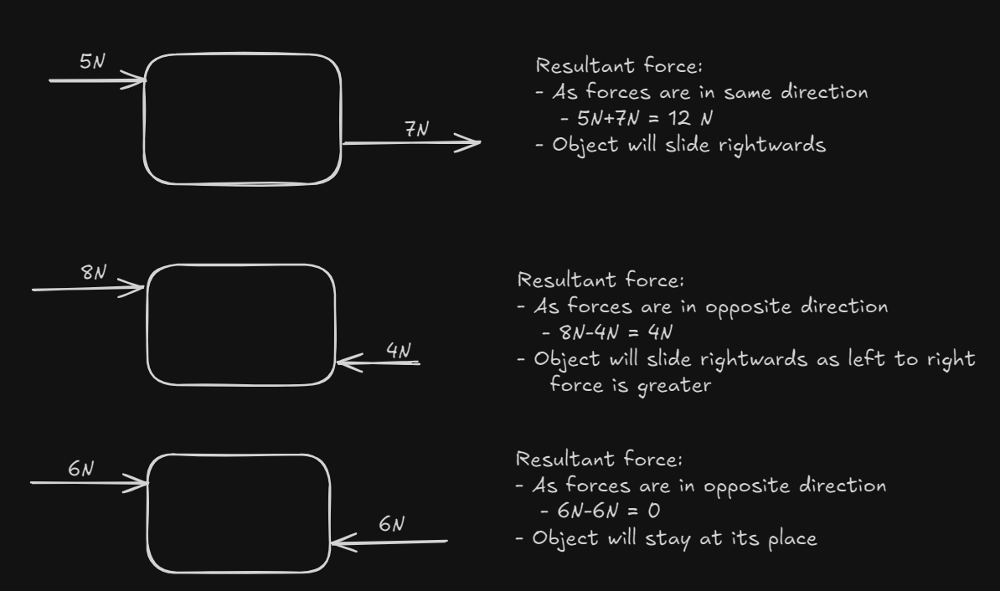

# Forces

## Introduction
- **Force**: A push or pull on an object.
  - Examples:
    - Pushing a pin into a board or pulling it out.
    - Changing the direction of a cricket ball with a bat.
    - Changing the shape of an object (e.g., molding clay).

## Effects of Forces
- **Move a Stationary Object**: Example: Kicking a football at rest.
- **Stop a Moving Object**: Example: Catching a ball.
- **Change Speed of a Moving Object**: Example: Pedaling a bicycle faster or pressing the brakes.
- **Change Direction of Motion**: Example: Hitting a tennis ball with a racquet.
- **Change Size or Shape**: Example: Squeezing or stretching clay.

## Types of Forces
### Contact Forces
- **Muscular Force**: Force applied by muscles (e.g., lifting a bag).
- **Frictional Force**: Opposes the movement of surfaces in contact.

### Non-contact Forces
- **Gravitational Force**: Attraction between objects with mass (e.g., Earth’s gravity).
  - It acts o all objects on the earth and pull them towards the centre of the planet.
  - This is the reason why river flows downward from height, object comes back when thrown upwards etc.
  - ***WEIGHT DEPENDS ON GRAVITY***: The weight of an object on earth is the force with which it is attracted by the earth. So weight can vary depending on the gravity.
    - The gravitational force of earth is six times that of the moon, so an object will weigh 6 times more on earth than moon.
  # Mass vs. Weight

| Feature               | Mass                               | Weight                               |
|-----------------------|------------------------------------|--------------------------------------|
| **Definition**        | Amount of matter in an object.     | Force exerted by gravity on an object. |
| **Unit**              | Kilogram (kg), gram (g), etc.       | Newton (N)                           |
| **Measurement**       | Measured using a balance scale.     | Measured using a spring balance or scale. |
| **Characteristics**   |                                    |                                      |
| **Scalar/Vector**       | Scalar (magnitude only)             | Vector (magnitude and direction)     |
| **Dependence on Location** | Constant                        | Varies with gravitational field strength |
| **Formula**           | N/A                                | Weight = Mass × Gravitational Acceleration |
| **Gravitational Acceleration (Earth)** | N/A                        | 9.8 m/s²                              |
| **Example (10 kg)**   | 10 kg remains 10 kg everywhere.    | On Earth: 10 kg × 9.8 m/s² = 98 N; On Moon: 98 N / 6 ≈ 16.3 N |

- **Magnetic Force**: Attraction or repulsion between two magnets or betweem a magnet and another material.
  - A magnet hs two poles ***North Pole*** and ***South Pole***. Opposite(Unlike) poles attract each other while Similar(like) poles repel each other.
- **Electrostatic Force**: Attraction or repulsion between electrically charged objects.
  - When we rub a plastic comb against our dry hair, the comb becomes charged, if we hold tiny pieces of paper, the pieces stick to the comb because of electrostatic force.
  - There are two types of charges: ***Positive*** and ***Negative***. Opposite charges attract, like charges repel.

## Measurement of Force
- Force is expressed in terms of its ***magnitude*** and its ***direction***.
  - When *two forces* act on an object in *same direction* then ***Resultant force*** = Sum of the two forces
  -  When *two forces* act on an object in *opposite direction* then ***Resultant force*** = Difference of the two forces
  -  When two *equal forces* act on an object in *opposite direction* then ***Resultant force*** = Zero
  
- **Unit**:
  - ***Newton(N)***
  - ***Kilogram-force(kgf)***
    - It is used to express the force exerted by the Earth and is used to express weight.
    - `1 Kgf = 10 N` (approximately)
      - 1 kgf is the force with which the Earth attracts and object of mass 1 kg towards its centre
- **Spring Balance**: Measures weight and forces by the length of the spring.
  - ***Principle***: The length of a spring increases uniformly as the weight pulling on it increases.

## Force of Friction
- **Friction**: Opposes the movement of an object on a surface.
  - **Factors Affecting Friction**:
    - Nature of the surfaces (smooth vs. rough).
      - Smooth surface => Less Friction
      - Rough surface => More Friction
    - Weight of the object.
      - Greater Weight, Greater Friction

## Types of Friction
- **Static Friction**: Acts between two objects at rest. Ex: Book on table
- **Sliding Friction**: Acts when one object slides over another.
- **Rolling Friction**: Acts when an object rolls over a surface.

  - ***static fricton>sliding friction>rolling friction***
    - This is why wheels and rollers are used to move heavy objects.

## Effects of Friction
- **Opposes Motion**: Slows down or stops the movement of objects.
- **Produces Heat**: Example: Rubbing hands or striking a match.
- **Causes Wear and Tear**: Wears out shoes, tires, and machinery.

## Advantages and Disadvantages of Friction
- **Advantages**:
  - Helps walk and run.
  - Aids in holding objects.
  - Assists in writing with pencils.
  - Keeps nails and screws fixed.
  - Helps in lighting matches.
  - Enables vehicle movement and stopping.

- **Disadvantages**:
  - More energy required to overcome friction.
  - Causes wear and tear.
  - Produces unwanted heat.

## Methods of Increasing Friction
- Increase surface roughness (e.g., treads on tires).
- Use materials with high friction (e.g., rubber soles).
- Sand and gravel on slippery surface.

## Methods of Reducing Friction
- **Polishing**: Makes surfaces smoother.
- **Using Lubricants**: Lubricants are substances that when aplplied between two surfaces reduces friction between surfaces. Ex: Oil, Grease, Powder
- **Using Ball Bearings**: Reduces friction by allowing rolling instead of sliding.
- **Streamlining**: It involves giving objcts a special streamlined shape to reduce drag in air and water. A streamlined shapeis rounded in the front and narrow at the back. Ex: Aeroplane , ships, fish etc
  - ***Drag***: The friction that occurs when objects pass through liquids and gases.