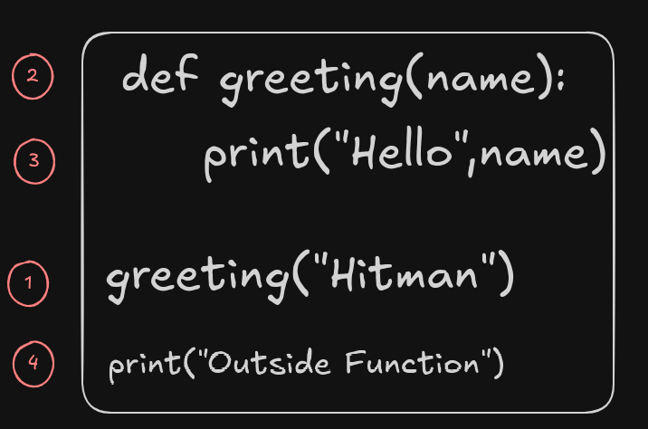

# Functions

## What is a function?
- A function is a block of code that performs a specific task.

## Creating a function in Python
```
def greeting():
    print("Hello")
```
- ***def*** keyword is used to create a function.
- def is followed by the name of the function. Here `greeting()` is the name of the function.
- Then using identation, the body of the function is written. Here the code that we need the function to perform is written.
  
## Calling a Function
- In the above example, it is just a declaration of the function `greeting()`
- If we, run this code, no output will be shown as creating a function doesn't mean we are executing the code inside it.
- To use this function, we need to call (invoke) the function.
- Function call: `greeting()`

***CODE***
```
def greeting():
    print("Hello")

greeting()
print("Outside Function")
```

***OUTPUT***
```
Hello
Outside Function
```

## Flow of the program
1. When the function `greeting()` is called, the program's control transfers to the function definition.
2. All the code inside the function is executed.
3. The control of the program jumps to the next statement after the function call.



## Arguments and Parameters

### Arguments
- Arguments are inputs given to the function.
- Arguments are the actual values that we pass to the function when we call it.
- Arguments replace the parameters when the function executes.

### Parameters
- Parameters are the variables listed inside the parentheses in the function definition. 
- They act like placeholders for the data the function can accept when we call them.

***CODE***
```
def greeting(name):
    print("Hello",name)

greeting("Hitman")
```


***OUTPUT***
```
Hello, Hitman
```

### default parameter
-  Default parameters are defined when a function is declared using the assignment operator (=). This allows omitting arguments during function calls, and the default values will be used instead.

***CODE***
```
def temperatureToKelvin(temp=None):
    if temp==None:
        return "Temperature could not be fetched"
    return temp+273

print("Temperature in Kelvin: " ,temperatureToKelvin())
print("Temperature in Kelvin: " ,temperatureToKelvin(50))
```

***OUTPUT***
```
Temperature in Kelvin:  Temperature could not be fetched
Temperature in Kelvin:  323
```

## return statement
- The return statement is used to return a value from the function.
- It denotes the end of the function.
- Any code after return won't be executed.
- When the value is returned, the function call is replaced by the value which has been returned. We can then store that value in a variable.

```
def difference(a,b):
    d = a-b;
    return d
diff=difference(60,50)
print("Difference: ",diff)
```


### returning multiple values

***CODE***
```
def values(name,age,places):
    return name,age,places

returnedValues=values("Hitman",31,["Morocoo","Georgia"])

n,a,p=values("Hitman",31,["Morocoo","Georgia"])

print("Returned Values: ",returnedValues)

print("Name: ",n)
print("Age: ",a)
print("Places: ",p)
```

***OUTPUT***
```
Returned Values:  ('Hitman', 31, ['Morocoo', 'Georgia'])
Name:  Hitman
Age:  31
Places:  ['Morocoo', 'Georgia']
```

### 1. Function with no parameters no return
***CODE***
```
def add_two_num():
    n1 = int(input("Enter first number: "))
    n2 = int(input("Enter second number: "))
    sum = n1+n2
    print("Sum is ",sum)

add_two_num()
```
***OUTPUT***
```
Enter first number: 5
Enter second number: 4
Sum is  9
```

### 2. Function with two parameters no return
***CODE***
```
def add_two_num(a,b):
    sum = a+b
    print("Sum is ",sum)

n1 = int(input("Enter first number: "))
n2 = int(input("Enter second number: "))
add_two_num(n1,n2)
```
***OUTPUT***
```
Enter first number: 4
Enter second number: 5
Sum is  9
```

### 3. Function with no parameters but returns value
***CODE***
```
def add_two_num():
    n1 = int(input("Enter first number: "))
    n2 = int(input("Enter second number: "))
    sum = n1+n2
    return sum

s=add_two_num()
print("Sum is ",s)
```
***OUTPUT***
```
Enter first number: 5
Enter second number: 4
Sum is  9
```

### 4.1 Function with parameters and return
***CODE***
```
def add_two_num(a,b):
    sum = a+b
    return sum

n1 = int(input("Enter first number: "))
n2 = int(input("Enter second number: "))
s = add_two_num(n1,n2)
print("Sum is ",s)
```
***OUTPUT***
```
Enter first number: 4
Enter second number: 5
Sum is  9
```
-  One important concept to understand when working with functions is the scope of variables—specifically, ***the difference between local and global variables.***

### 4.2 Function with parameters and return
```
def add_two_num(n1,n2):
    sum = n1+n2
    return sum

n1 = int(input("Enter first number: "))
n2 = int(input("Enter second number: "))
sum = add_two_num(n1,n2)
print("Sum is ",sum)
```

```
Enter first number: 4
Enter second number: 5
Sum is  9
```

- ***Local Variables***:Local variables are declared within a function and can only be accessed inside that function.
  - **Example**: In both 4.1 and 4.2, the variable `sum` is declared inside the add_two_num function. This means that sum is a local variable and its scope is limited to the add_two_num function.
- ***Global Variables***: Global variables are declared outside of any function and can be accessed from any part of the code.
  - **Example**: In both examples, the variables `n1`, `n2`, and `s` (or sum in 4.2) are declared outside of the add_two_num function. These variables are global and can be accessed from anywhere in the code after their declaration.
- ***Same Variable Names in Different Scopes***:
  - **In 4.2 example**, the variable name `sum` is used inside the function and outside the function. *Inside the function*, `sum`is a *local variable*, and *outside the function*, `sum` is a *global variable*.
  - These are different variables, despite having the same name. The local sum exists only within the add_two_num function, and the global sum exists in the broader scope of the program.
- ***No Conflict Between Local and Global Variables***:
  - Because local and global variables exist in different scopes, there is no conflict or error when using the same name for both. The Python interpreter distinguishes between them based on their scope.
  - **In example 4.1**, `s` is the global variable that holds the return value of the function, while sum is the local variable within the function.
  - **In example 4.2**, `sum` is both a local variable within the function and a global variable outside the function, but they are distinct and do not interfere with each other.

## *args
- `*args` allow a function to take any number of positional arguments.
- Imagine a situation where we are taking tests of students,and we need to add the marks of all students but we are not sure how many students will be giving the examination. The how many parameters will you provide in the function?
- The following code will give an error

***CODE***
```
def sumOfMarks(a,b):
    return a+b;
    
sumOfMarks(5,3) # 2 students gave the examination
sumOfMarks(5,3,2) # 3 students gave the examination
sumOfMarks(9,11,20,24) # 4 students gave the examination
```
***OUTPUT***
```
TypeError: sumOfMarks() takes 2 positional arguments but 3 were given
```

- The following code will also give error:

***CODE***
```
def sumOfMarks(a,b,c,d):
    return a+b;
    
sumOfMarks(5,3) # 2 students gave the examination
sumOfMarks(5,3,2) # 3 students gave the examination
sumOfMarks(9,11,20,24) # 4 students gave the examination
```
***OUTPUT***
```
TypeError: sumOfMarks() missing 2 required positional arguments: 'c' and 'd'
```

### Solution - using `*args` - Sum of all marks

***CODE***

```
def sumOfMarks(*marks):
    sum = 0
    for i in marks:
        sum = sum+i
    return sum
print(sumOfMarks(5,3)) # 2 students gave the examination
print(sumOfMarks(5,3,2)) # 3 students gave the examination
print(sumOfMarks(9,11,20,24)) # 4 students gave the examination
```

***OUTPUT***
```
8
10
64
```

***NOTE***: When we pass multiple arguments in a function and accept all of them using `*args` a tuple is created.


### Solution - using `*args` - Sum of all marks - using sum() function

***CODE***

```
def sumOfMarks(*marks):
    return(sum(marks))
print(sumOfMarks(5,3)) # 2 students gave the examination
print(sumOfMarks(5,3,2)) # 3 students gave the examination
print(sumOfMarks(9,11,20,24)) # 4 students gave the examination
```

***OUTPUT***
```
8
10
64
```


## **kwargs
- `**kargs` allow the function to acccept any number of keyword arguments.

***CODE***

```
def avengers(**words):
    for key, value in words.items():
        print(f"{key}: {value}")
    print("-------------------")

avengers(name="Captain America", weapon="Shield")
avengers(name="Thor", weapon="Hammer",planet="Asgard")
avengers(name="Hulk")
```

***OUTPUT***
```
name: Captain America
weapon: Shield
-------------------
name: Thor
weapon: Hammer
planet: Asgard
-------------------
name: Hulk
-------------------
```