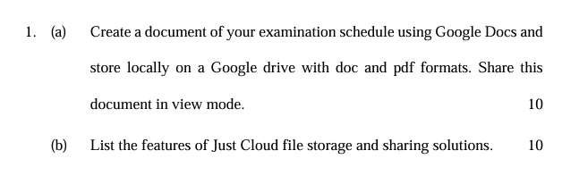
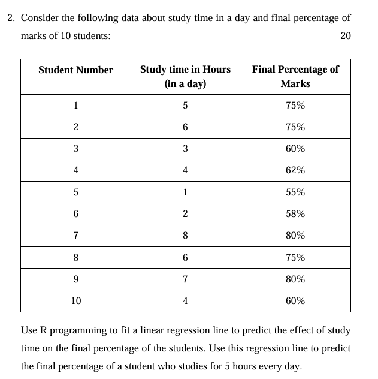

# (a) Create a Document of Examination Schedule

## Steps to Create the Document

1. **Open Google Docs:**
   - Go to [Google Docs](https://docs.google.com/) and click on “Blank” to create a new document.

2. **Add Content to the Document:**
   - **Title:** Examination Schedule
   - **Headings and Content:**
     - **Subject:** Mathematics
       - **Date:** 2024-08-15
       - **Time:** 09:00 AM - 12:00 PM
     - **Subject:** Physics
       - **Date:** 2024-08-17
       - **Time:** 01:00 PM - 04:00 PM
     - **Subject:** Chemistry
       - **Date:** 2024-08-20
       - **Time:** 09:00 AM - 12:00 PM

3. **Store the Document on Google Drive:**
   - Click on `File` -> `Download` -> `Microsoft Word (.docx)` to save the document in `.docx` format.
   - Click on `File` -> `Download` -> `PDF Document (.pdf)` to save the document in `.pdf` format.

4. **Share the Document:**
   - Click on the `Share` button in the top-right corner.
   - In the sharing settings, click on `Anyone with the link` and set it to `Viewer`.
   - Copy the link and share it as needed.

---

# (b) Features of Just Cloud File Storage and Sharing Solutions

- **Cloud Storage:** Secure and scalable online storage for files and data.
- **File Sharing:** Share files and folders with others through links or email invitations.
- **Sync Across Devices:** Automatically sync files across multiple devices for easy access.
- **Backup and Restore:** Backup important files and restore them if needed.
- **File Versioning:** Keep track of changes with version history and restore previous versions.
- **Access Controls:** Set permissions for viewing, editing, or sharing files.
- **Collaboration Tools:** Collaborate on documents with real-time editing and commenting.
- **Encryption:** Data encryption for security and privacy.
- **Mobile Access:** Access and manage files from mobile devices through apps.
- **Integration:** Integrates with other services and applications for seamless workflow.



```
# Define the data
study_time <- c(5, 6, 3, 4, 1, 2, 8, 6, 7, 4)
final_percentage <- c(75, 75, 60, 62, 55, 58, 80, 75, 80, 60)

# Fit a linear regression model
model <- lm(final_percentage ~ study_time)

# Print the summary of the model to see the coefficients
summary(model)

# Predict the final percentage for a student who studies for 5 hours a day
new_study_time <- data.frame(study_time = 5)
predicted_percentage <- predict(model, new_study_time)

# Print the predicted final percentage
cat("Predicted final percentage for a student who studies for 5 hours a day:", predicted_percentage, "%\n")

# Plot the data and the regression line
plot(study_time, final_percentage, main = "Study Time vs Final Percentage",
     xlab = "Study Time (Hours per Day)", ylab = "Final Percentage (%)", pch = 19, col = "blue")
abline(model, col = "red")

```