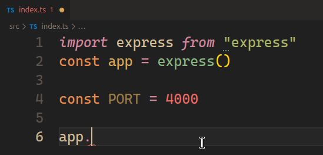
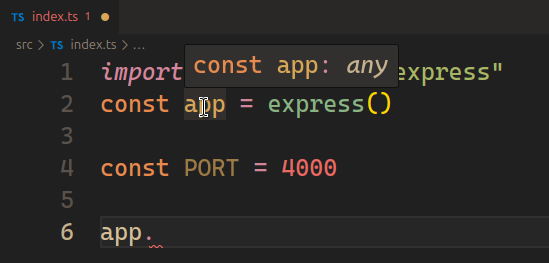
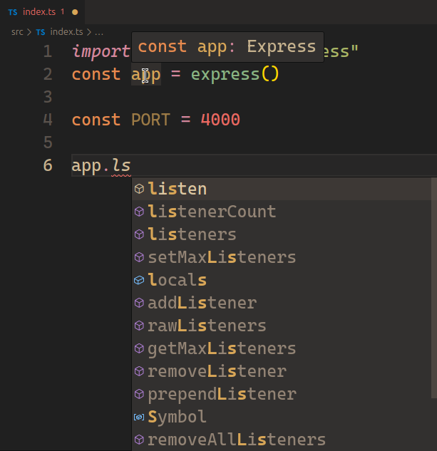
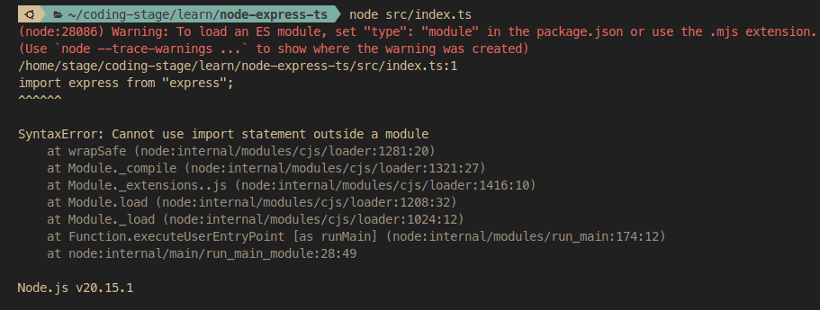
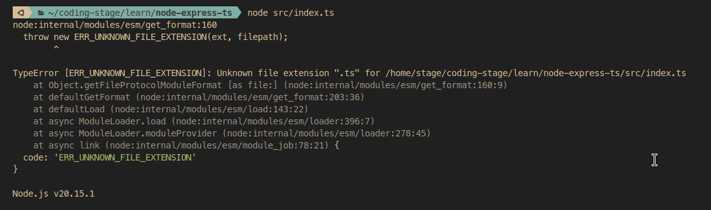
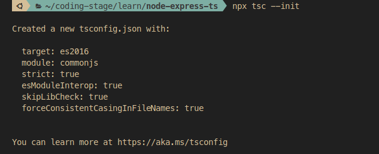
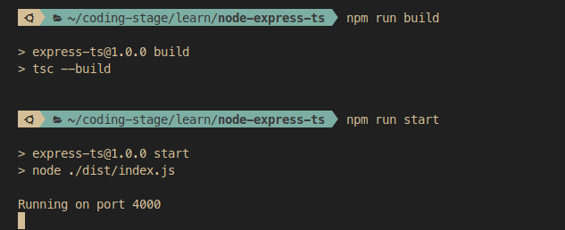

1. `npm init -y`
2. `npm i express`
3. `npm i -D typescript`
4. Create index.ts file. 
	 
	-  Here we can see that when I type app. Nothing is been suggested. When I hover over the app variable it shows of type *any* which should be of type express. So we need to install type definitions for express.
	  
5. `npm i -D @types/express` : This package contains type definitions for express
	- Similarly, there are type definitions for most of the packages.
6. After installation 
     
     - It may happen that after installation, the types are still not reflected. In that case, go to command palette and restart TS server.
7. Now let's try to run the index.ts file : `node src/index.ts`
     
	- As we haven't defined "type"="module" in our package.json file, The ES6 import statement would not work and It might not work with ts anyway. So let's change the type first.
	- Let's run it again
		 
	- There is again an error saying that *Unkown file extension ts.* That's because it needs a JS file, not a TS file.
	- So we need to transpile our ts file.
8. First of all we need *tsconfig.json* file. Create it using: `npx tsc --init`. It will create this file with default configuration.
     
9. Within this huge file we need to do some changes.
	1. Change the module to "ES6"
	2. Un-comment "rootDir" and change the value to "./src" as all of our code is in src folder.
	3. Un-comment "outDir" and change the value to "./dist" - Here all the transpiled code will be generated.
	4. Change the following to leverage the effectiveness of typescript : *"noImplicitAny": true*, *"strictNullChecks": true,* *"strictFunctionTypes": true,*
10. Now we need to transpile. For that go  to package.json  and add build script - ***"build":"tsc --build"** 
11. Then add the start script: ***"start":"node ./dist/index.js"***
12. Now we can build using "npm run build" and start using "npm run start"
     
 13. Nodemon setup
	 - `npm i -D nodemon`
	 - Tried "ts-node" but it failed to run .ts file.
	 - So for now, going with *"dev": "tsc && nodemon ./dist/index.js"* in my package.json