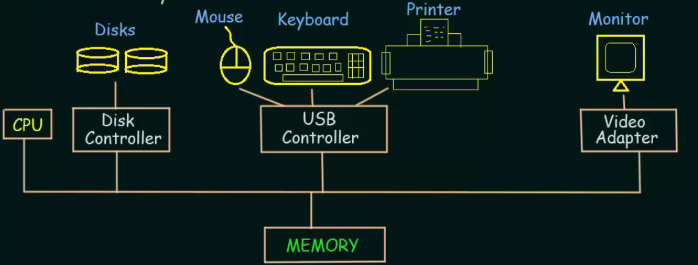

# Basics of Computer System
- A modern general-purpose computer system consists of one or more CPUs and a number of device device controllers connected through a common bus that provides access to shared memory.
 
 - Each device controller is in charge of a specific type of device.
 - The CPU and the device controllers can execute concurrently, competing for memory cycles.
 - To ensure orderly access to the shared memory, a memory controller is provided whose function is to synchronize access to the memory.
## Some Important Terms
### Bootstrap Program
- The initial program that runs when a computer is powered up or rebooted.
- It is stored in the ROM.
- It must know how to load the OS and start executing that system.
- It must locate and load into memory the OS kernel(main part of the OS).
### Interrupt
- The occurrence of an event is usually signalled by an Interrupt from Hardware or Software
- Hardware may trigger an interrupt at any time by sending a signal to the CPU, usually by the way of the system bus.
### System Call(Monitor Call)
- Software may trigger an interrupt by executing a special operation called System Call.

## What does the CPU do when Interrupt occurs?
- When the CPU is interrupted, it stops what it is doing and immediately transfers execution to a ***fixed location***.
- The fixed location usually contains the starting address where the service routine if the interrupt is located.
- The Interrupt Service Routine Executes (ISR)
- On Completion, the CPU resumes the interrupted computation.