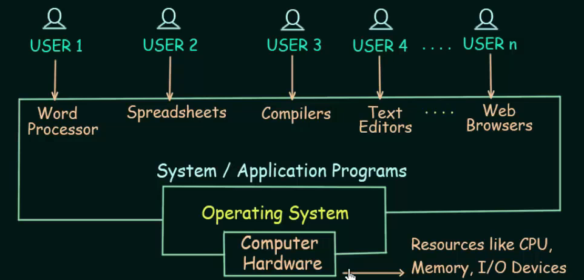

# Introduction
- An Operating System(OS) is a program that  manages the computer hardware.
- It also provides a basis for Application Programs and acts as an ***intermediary*** between computer **user** and **hardware**.
- Ex:  Windows, Ubuntu(Linux), MacOs, iOs, Android
  

## # Why Do We Need an Operating System?

Operating Systems (OS) are essential because they act as intermediaries between users, applications, and the computer's hardware. Without an OS, a user would need to directly manage the hardware, which is highly complex and inefficient. The OS simplifies this process by providing a platform where applications can run and by managing hardware resources like memory, processors, and storage.

## Simple Example: Running a Music Player on a Computer

Imagine you want to play a song using a music player application. The OS makes this possible in the following ways:

### 1. User Interaction
- You open the music player by clicking its icon. The **OS's GUI** (Graphical User Interface) detects this click, interprets it as a request to open the app, and launches the application.

### 2. Memory Management
- Once the music player is open, the OS **allocates memory** (RAM) to load the application. It decides how much memory the music player needs, preventing other apps from interfering with it.

### 3. File System Management
- The music player asks for the song file you want to play. The OS manages the **file system**, finding the file in your computer’s storage (hard drive or SSD) and giving access to the music player.

### 4. Hardware Control
- When the song starts playing, the OS coordinates between the music player and your computer's **sound card** (hardware responsible for audio output). The OS sends the digital music data to the sound card, which then converts it to sound waves played through your speakers.

### 5. Multitasking
- While the song is playing, you might decide to open a web browser or check an email. The OS ensures that all applications (music player, browser, email app) can run simultaneously without conflicts. It **multitasks** by distributing CPU time and resources efficiently among them.

### 6. Device Management
- If you plug in headphones while the song is playing, the OS detects the new hardware (headphones) and reroutes the audio output from the speakers to the headphones.

### 7. Security
- The OS also provides **security** by ensuring that no malicious application can tamper with your music player or access sensitive data without your permission.

## Without an OS
- You’d have to manually allocate memory, load the song from storage, send the correct signals to the sound card, and manage hardware connections like headphones — all of which would require advanced knowledge of the computer’s hardware.

The OS abstracts these complexities, making it easy for you to simply click and play the song!

## Types of OS
- **Batch OS**
- **Time Sharing OS**
- **Distributed OS**
- **Network OS**
- **Real Time OS**
- **Multi Programming/Tasking OS**

## Functions of OS
- It is an interface between User and Hardware
- Allocation of Resources
- Management of Memory, Security etc.

## Goals of OS
- Convenience
- Efficiency
- Both