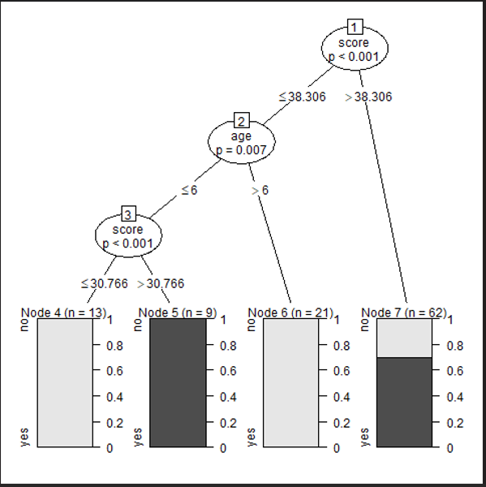

## Decision Tree
```
install.packages('party')
library(party)

# Create the input data frame.
input.data <- readingSkills[c(1:105), ]

# Give the chart file a name.
png(file = "decision_tree.png")

# Create the tree.
output.tree <- ctree(nativeSpeaker ~ age + shoeSize + score,
                     data = input.data)

# Plot the tree.
plot(output.tree)

# Save the file.
dev.off()
```



