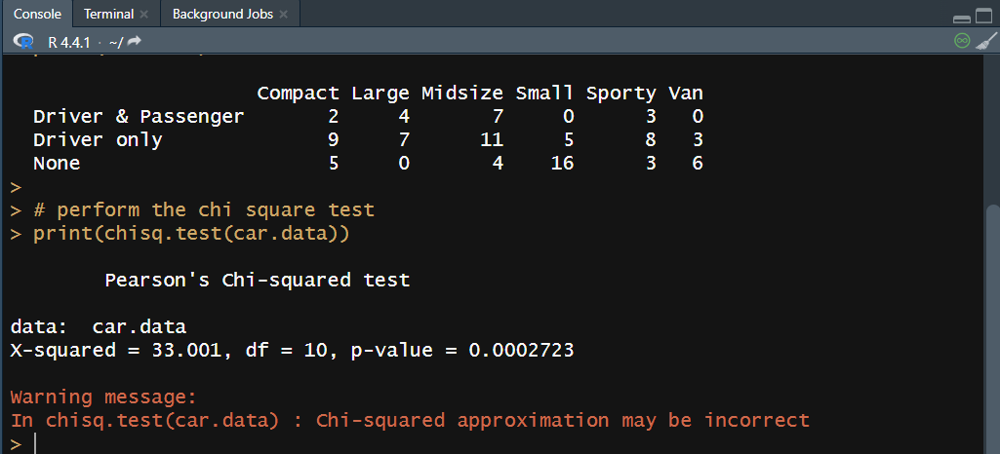

## Chi Square Test

```
# R's built in mass library that contains Cars93 dataset
library(MASS)
# print(str(Cars93))

#create a data frame from the main data set
car.data = data.frame(Cars93$AirBags, Cars93$Type)

#create a table with the needed variables
car.data = table(Cars93$AirBags,Cars93$Type)
print(car.data)

# perform the chi square test
print(chisq.test(car.data))
```
