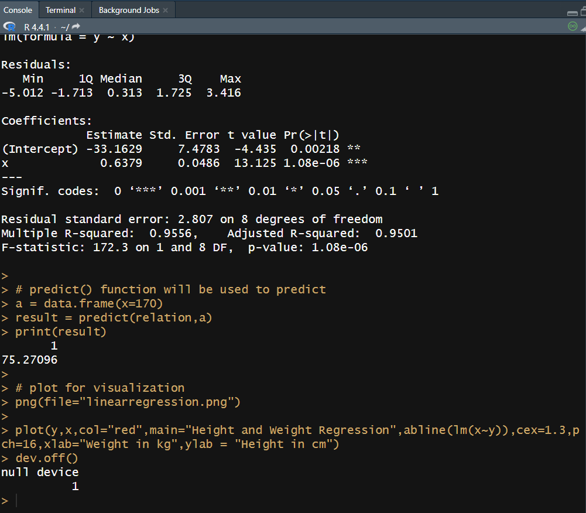
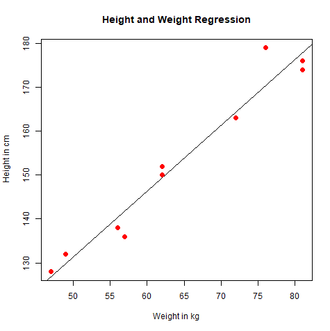

## Linear Regression

```
#values of height
x = c(150,174,138,176,128,136,179,163,152,132)
y = c(62,81,56,81,47,57,76,72,62,49)

# lm() function to create the relational model
relation = lm(y~x)
print(relation)
print(summary(relation))

# predict() function will be used to predict
a = data.frame(x=170)
result = predict(relation,a)
print(result)

# plot for visualization
png(file="linearregression.png")

plot(y,x,col="red",main="Height and Weight Regression",abline(lm(x~y)),cex=1.3,pch=16,xlab="Weight in kg",ylab = "Height in cm")
dev.off()
```
- The x-axis represents weight in kilograms(xlab="Weight in kg").
- The y-axis represents height in centimeters(ylab = "Height in cm").
- The points in the plot are colored red(col="red") and are solid circles(pch=16) of size 1.3(cex=1.3).
- A linear regression line is added(abline(lm(x~y))) to show the relationship between weight and height.
- The main title of the plot is "Height and Weight Regression"(main="Height and Weight Regression).


