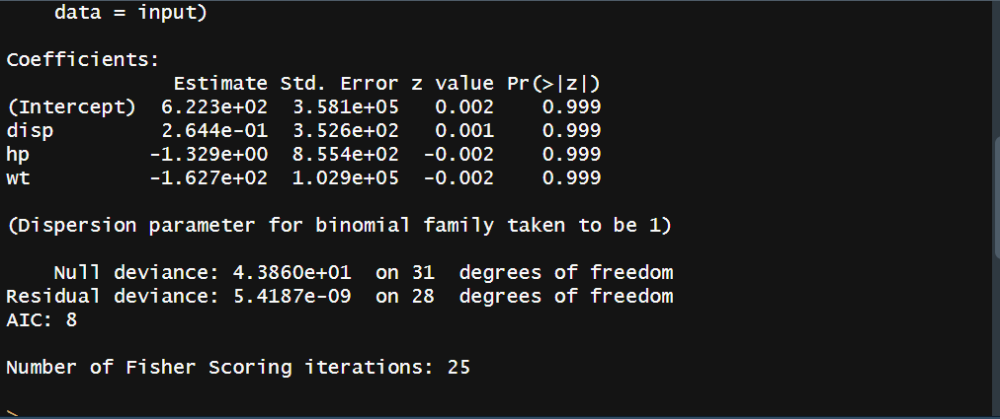
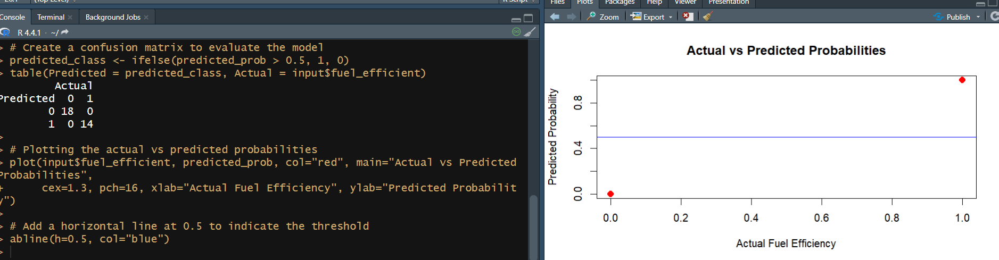

## Logistic Regression
```
# Load the dataset and select specific columns
input <- mtcars[, c("mpg", "disp", "hp", "wt")]

# Create a binary variable for fuel efficiency
input$fuel_efficient <- ifelse(input$mpg > 20, 1, 0)

# Perform logistic regression
logistic_model <- glm(fuel_efficient ~ disp + hp + wt, data = input, family = binomial)

# Show the model summary
summary(logistic_model)

# Get the predicted probabilities
predicted_prob <- predict(logistic_model, type = "response")

# Create a confusion matrix to evaluate the model
predicted_class <- ifelse(predicted_prob > 0.5, 1, 0)
table(Predicted = predicted_class, Actual = input$fuel_efficient)

# Plotting the actual vs predicted probabilities
plot(input$fuel_efficient, predicted_prob, col="red", main="Actual vs Predicted Probabilities",
     cex=1.3, pch=16, xlab="Actual Fuel Efficiency", ylab="Predicted Probability")

# Add a horizontal line at 0.5 to indicate the threshold
abline(h=0.5, col="blue")
```


