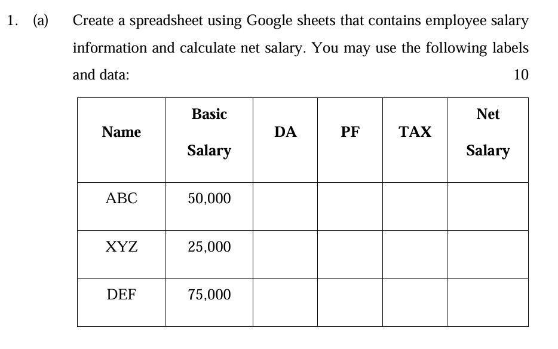
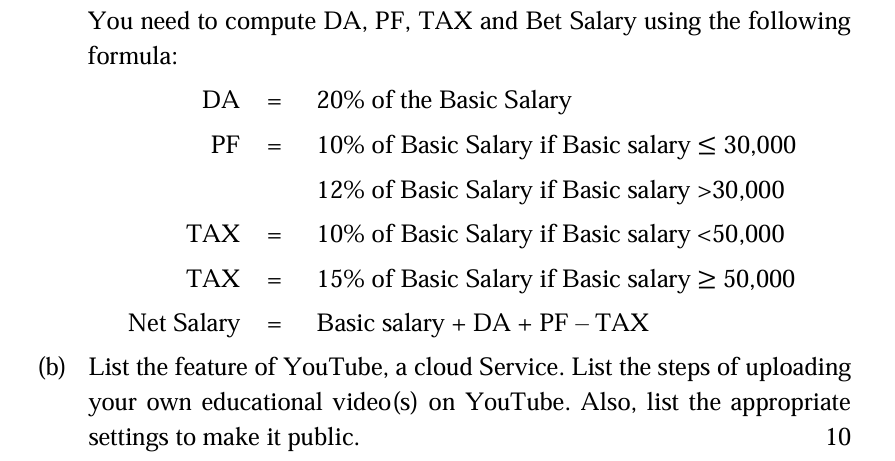
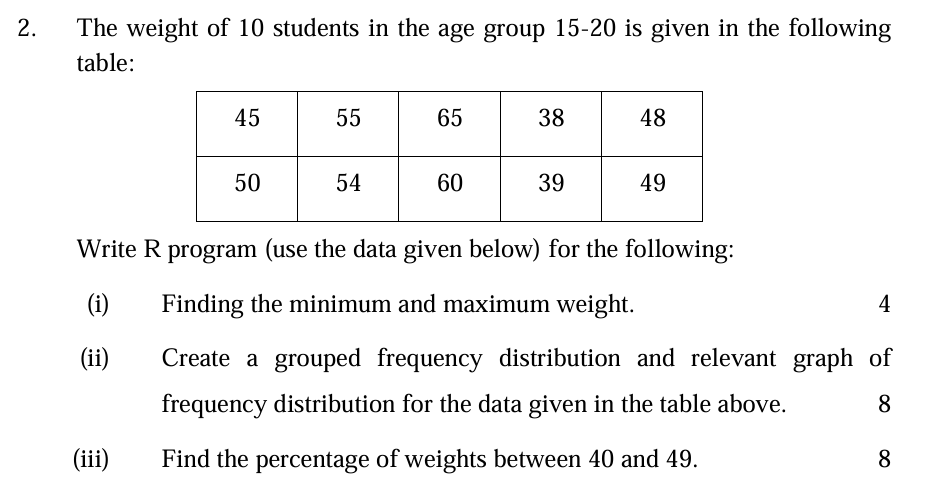

# Employee Salary Calculation

| Name | Basic Salary | DA             | PF                               | TAX                              | Net Salary                      |
|------|--------------|----------------|----------------------------------|----------------------------------|---------------------------------|
| ABC  | 50,000       | `=B2 * 20%`    | `=IF(B2 <= 30000, B2 * 10%, B2 * 12%)` | `=IF(B2 < 50000, B2 * 10%, B2 * 15%)` | `=B2 + C2 - E2`                  |
| XYZ  | 25,000       | `=B3 * 20%`    | `=IF(B3 <= 30000, B3 * 10%, B3 * 12%)` | `=IF(B3 < 50000, B3 * 10%, B3 * 15%)` | `=B3 + C3 - E3`                  |
| DEF  | 75,000       | `=B4 * 20%`    | `=IF(B4 <= 30000, B4 * 10%, B4 * 12%)` | `=IF(B4 < 50000, B4 * 10%, B4 * 15%)` | `=B4 + C4 - E4`                  |

# YouTube Features and Upload Instructions

## Features of YouTube
- **Video Hosting:** Platform to upload, store, and share videos.
- **Video Playback:** Stream videos in various qualities including HD and 4K.
- **Monetization:** Earn money through ads, memberships, and Super Chat.
- **Live Streaming:** Broadcast live events and interact with viewers in real-time.
- **Playlists:** Organize videos into playlists for easy access and viewing.
- **Subscriptions:** Users can subscribe to channels to receive updates and notifications.
- **Comments and Likes:** Engage with viewers through comments and likes/dislikes.
- **Analytics:** Access detailed statistics on video performance and audience engagement.
- **Video Editing:** Basic editing tools for trimming, adding music, and applying filters.
- **Captions and Subtitles:** Add captions and subtitles to make content accessible.
- **Community Features:** Create posts and interact with viewers via community tab.
- **Content Recommendations:** Personalized video recommendations based on viewing history.

## Steps to Upload Your Own Educational Video(s) on YouTube

1. **Sign In to YouTube:**
   - Go to [YouTube](https://www.youtube.com/) and sign in with your Google account.

2. **Access the Upload Page:**
   - Click on the camera icon with a "+" sign (Create button) located at the top-right corner.
   - Select `Upload video` from the dropdown menu.

3. **Upload Your Video:**
   - Click `Select files` to choose the video file from your computer or drag and drop the file into the upload area.
   - While the video uploads, you can enter the video details.

4. **Enter Video Details:**
   - **Title:** Provide a descriptive title for your video.
   - **Description:** Add a detailed description including key information and links.
   - **Thumbnail:** Choose or upload a custom thumbnail image for your video.
   - **Playlist:** Add your video to a playlist if applicable.

5. **Select Video Settings:**
   - **Audience:** Indicate if the video is made for kids or not.
   - **Age Restriction:** Set age restrictions if the content is not suitable for all ages.

6. **Add Video Elements:**
   - **End Screens:** Add interactive elements at the end of your video.
   - **Cards:** Add clickable cards to promote other content or external links.

7. **Set Visibility:**
   - **Public:** Choose this option to make the video available to everyone.
   - **Unlisted:** The video can be viewed by anyone with the link.
   - **Private:** Only specific users you invite can view the video.

8. **Publish Your Video:**
   - Click `Publish` to make the video live based on the visibility setting you chose.
   - If you selected `Scheduled`, set the date and time for when the video should be published.

## Appropriate Settings to Make Your Video Public

- **Visibility:** Set to `Public`.
- **Distribution:** Ensure the video is not restricted or age-restricted unless necessary.
- **Search Settings:** Allow the video to appear in search results and suggested videos.
- **Sharing Options:** Ensure that sharing options are enabled for broad distribution.



```
# Define the weight data
weights <- c(45, 55, 65, 38, 50, 54, 60, 48, 39, 49)

# Find the minimum and maximum weight
min_weight <- min(weights)
max_weight <- max(weights)

# Print the results
cat("Minimum Weight:", min_weight, "\n")
cat("Maximum Weight:", max_weight, "\n")

# Create a grouped frequency distribution
# Define the breaks for grouping
breaks <- seq(30, 70, by = 10)  # Adjust the range and intervals as needed

# Cut the data into groups
weight_groups <- cut(weights, breaks = breaks, right = FALSE)

# Create a table of frequencies for each group
freq_table <- table(weight_groups)

# Print the frequency table
print(freq_table)

# Save the plot as a PNG file
png(filename = "frequency_distribution2.png")

# Plot the frequency distribution
barplot(freq_table, main = "Grouped Frequency Distribution of Weights",
        xlab = "Weight Groups", ylab = "Frequency", col = "lightblue")

# Find the number of weights between 40 and 49
weights_in_range <- weights[weights >= 40 & weights <= 49]
num_in_range <- length(weights_in_range)

# Calculate the percentage
total_weights <- length(weights)
percentage_in_range <- (num_in_range / total_weights) * 100

# Print the percentage
cat("Percentage of weights between 40 and 49:", percentage_in_range, "%\n")
```