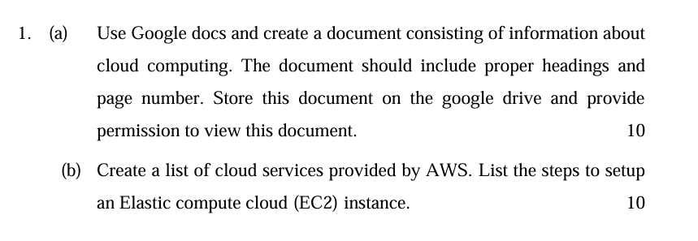
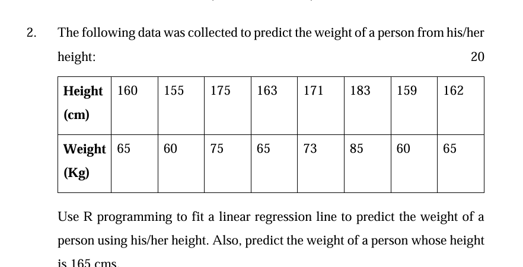

# Creating a Google Docs Document on Cloud Computing

## Open Google Docs:
- Go to [Google Docs](https://docs.google.com/) and click on “Blank” to create a new document.

## Add Content to the Document:

### Title: Cloud Computing

### Headings and Content:

#### Introduction to Cloud Computing
- Cloud computing refers to the delivery of computing services over the internet (the cloud) to offer faster innovation, flexible resources, and economies of scale.

#### Types of Cloud Services
- **IaaS (Infrastructure as a Service):** Examples include AWS EC2, Google Compute Engine.
- **PaaS (Platform as a Service):** Examples include Google App Engine, Heroku.
- **SaaS (Software as a Service):** Examples include Google Workspace, Salesforce.

#### Benefits of Cloud Computing
- **Cost Efficiency:** Pay only for what you use.
- **Scalability:** Easily scale resources up or down.
- **Flexibility:** Access services from anywhere.
- **Security:** Advanced security features and compliance certifications.

#### Challenges of Cloud Computing
- **Downtime:** Risk of service outages.
- **Security:** Concerns over data privacy and security.
- **Compliance:** Ensuring compliance with regulations.
- **Cost Management:** Controlling the cost of cloud resources.

## Page Numbers:
- Go to `Insert` -> `Page numbers` -> Choose the preferred format.

## Store the Document on Google Drive:
- Click on `File` -> `Move to` -> Select the desired folder in Google Drive or create a new folder.

## Share the Document:
- Click on the `Share` button in the top-right corner.
- In the sharing settings, click on `Anyone with the link` and set it to `Viewer`.
- Copy the link and share it as needed.


# AWS Services Overview

## Compute Services
- **Amazon EC2 (Elastic Compute Cloud):** Scalable virtual servers for running applications.
- **AWS Lambda:** Serverless compute service that runs code in response to events.
- **Amazon ECS (Elastic Container Service):** Managed container orchestration service.
- **AWS Fargate:** Serverless compute engine for containers.

## Storage Services
- **Amazon S3 (Simple Storage Service):** Scalable object storage for data backup and archiving.
- **Amazon EBS (Elastic Block Store):** Persistent block storage for EC2 instances.
- **Amazon Glacier:** Low-cost storage service for archival and long-term backup.

## Database Services
- **Amazon RDS (Relational Database Service):** Managed relational database service supporting multiple engines.
- **Amazon DynamoDB:** Fully managed NoSQL database for fast and flexible performance.
- **Amazon Redshift:** Managed data warehouse for large-scale data analytics.

## Networking Services
- **Amazon VPC (Virtual Private Cloud):** Isolated virtual network for your AWS resources.
- **AWS Direct Connect:** Dedicated network connection from your premises to AWS.
- **Amazon Route 53:** Scalable DNS and domain name registration service.

## Security Services
- **AWS IAM (Identity and Access Management):** Manage user access and permissions to AWS resources.
- **AWS KMS (Key Management Service):** Manage and control encryption keys for data security.
- **AWS Shield:** DDoS protection for applications running on AWS.

## Analytics Services
- **Amazon EMR (Elastic MapReduce):** Big data processing using Hadoop, Spark, and other frameworks.
- **Amazon Kinesis:** Real-time data processing and analytics.
- **AWS Glue:** Fully managed ETL (extract, transform, load) service for data preparation.

## Developer Tools
- **AWS CodeDeploy:** Automated deployment of applications to various compute services.
- **AWS CodePipeline:** Continuous integration and delivery service for faster software releases.
- **AWS CodeBuild:** Fully managed build service for compiling code and running tests.

## Machine Learning
- **Amazon SageMaker:** End-to-end machine learning service for building, training, and deploying models.
- **AWS Rekognition:** Image and video analysis service using machine learning.
- **AWS Lex:** Build conversational interfaces using voice and text with chatbot technology.


```
# Define the data
height <- c(160, 155, 175, 163, 171, 20, 183, 159, 65, 60, 75, 162)
weight <- c(65, 73, 85, 60, 65, 0, 85, 59, 73, 60, 85, 66)

# Fit a linear regression model
model <- lm(weight ~ height)

# Print the summary of the model to see the coefficients
summary(model)

# Predict the weight for a height of 165 cm
new_height <- data.frame(height = 165)
predicted_weight <- predict(model, new_height)

# Print the predicted weight
cat("Predicted weight for a height of 165 cm:", predicted_weight, "Kg\n")

# Plot the data and the regression line
plot(height, weight, main = "Height vs Weight",
     xlab = "Height (cm)", ylab = "Weight (Kg)", pch = 19, col = "blue")
abline(model, col = "red")
```