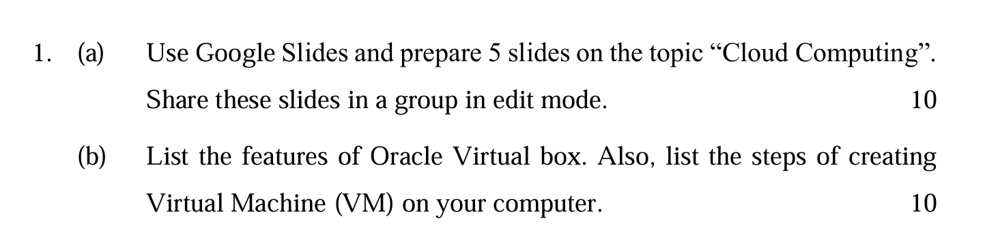
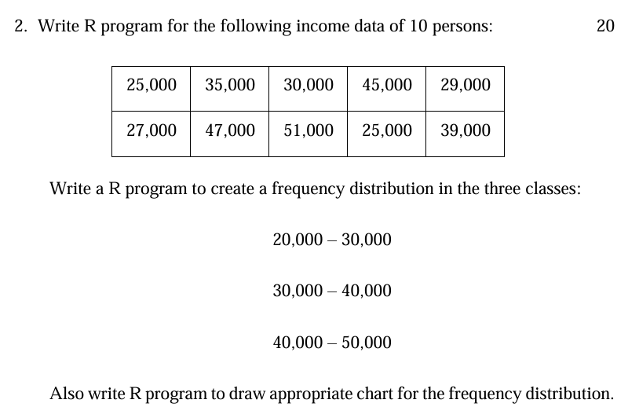

# Cloud Computing Google Slides

## To create a Google Slides presentation on "Cloud Computing," follow these steps:

### Open Google Slides
- Go to Google Slides and click on "Blank" to start a new presentation.

### Title Slide
- **Title:** Cloud Computing
- **Subtitle:** An Introduction to Cloud Technology
- **Content:** Your name and date

### Slide 2: What is Cloud Computing?
- **Title:** What is Cloud Computing?
- **Content:**
  - **Definition:** Cloud computing is the delivery of computing services over the internet (the cloud) to offer faster innovation, flexible resources, and economies of scale.
  - **Examples:** Google Drive, Dropbox, Amazon Web Services (AWS).

### Slide 3: Types of Cloud Services
- **Title:** Types of Cloud Services
- **Content:**
  - **IaaS:** Infrastructure as a Service (e.g., AWS EC2, Google Compute Engine)
  - **PaaS:** Platform as a Service (e.g., Google App Engine, Heroku)
  - **SaaS:** Software as a Service (e.g., Google Workspace, Salesforce)

### Slide 4: Benefits of Cloud Computing
- **Title:** Benefits of Cloud Computing
- **Content:**
  - **Cost Efficiency:** Pay only for what you use.
  - **Scalability:** Easily scale resources up or down.
  - **Flexibility:** Access services from anywhere.
  - **Security:** Advanced security features and compliance certifications.

### Slide 5: Challenges of Cloud Computing
- **Title:** Challenges of Cloud Computing
- **Content:**
  - **Downtime:** Risk of service outages.
  - **Security:** Concerns over data privacy and security.
  - **Compliance:** Ensuring compliance with regulations.
  - **Cost Management:** Controlling the cost of cloud resources.

### Share the Presentation
- Click on the "Share" button in the top right corner of Google Slides.
- Enter the email addresses of the people you want to share the presentation with.
- Ensure the sharing settings are set to "Anyone with the link can edit" if you want them to be able to edit the slides.

---

# Features of Oracle VirtualBox and Steps to Create a Virtual Machine

## Features of Oracle VirtualBox
- **Cross-Platform Support:** Available on Windows, macOS, Linux, and Solaris.
- **Guest Operating System Support:** Supports a wide range of guest operating systems, including Windows, Linux, macOS, and more.
- **Snapshots:** Ability to take snapshots of the current state of a virtual machine and revert back to them.
- **Seamless Mode:** Integrate guest applications with the host desktop, allowing for seamless interaction.
- **Shared Folders:** Share folders between the host and guest systems for easy file transfer.
- **Virtual Network Adapters:** Support for multiple virtual network adapters, including bridged, NAT, and host-only networking.
- **Extensible:** Support for third-party extensions and plug-ins.
- **Command Line Interface:** Full control over VirtualBox via a command line interface (VBoxManage).
- **3D Graphics Acceleration:** Support for 3D graphics acceleration for better performance of graphical applications.
- **Remote Desktop Protocol (RDP):** Built-in support for connecting to virtual machines via RDP.

## Steps to Create a Virtual Machine in Oracle VirtualBox
1. **Download and Install VirtualBox:**
   - Go to the VirtualBox website.
   - Download the installer for your operating system.
   - Run the installer and follow the on-screen instructions to install VirtualBox.

2. **Open VirtualBox:**
   - Launch VirtualBox from your applications menu or start menu.

3. **Create a New Virtual Machine:**
   - Click the "New" button in the VirtualBox Manager.
   - Enter a name for your virtual machine.
   - Select the type and version of the operating system you want to install.

4. **Allocate Memory:**
   - Choose the amount of RAM to allocate to the virtual machine. A minimum of 2GB is recommended for modern operating systems.

5. **Create a Virtual Hard Disk:**
   - Select "Create a virtual hard disk now" and click "Create."
   - Choose the hard disk file type (VDI is recommended).
   - Decide whether to use a dynamically allocated or fixed-size disk. A dynamically allocated disk grows as you add data to it, while a fixed-size disk takes up the specified amount of space immediately.
   - Set the size of the virtual hard disk and click "Create."

6. **Configure Virtual Machine Settings (Optional):**
   - Select your virtual machine and click "Settings."
   - Configure settings such as system, display, storage, audio, network, USB, and shared folders as needed.

7. **Install the Operating System:**
   - Select your virtual machine and click "Start."
   - Choose the installation media (ISO file) for the operating system you want to install.
   - Follow the on-screen instructions to complete the installation of the operating system.

8. **Install VirtualBox Guest Additions:**
   - After installing the operating system, go to the "Devices" menu and select "Insert Guest Additions CD image."
   - Follow the prompts to install the Guest Additions, which provide enhanced features and performance.

9. **Configure Shared Folders (Optional):**
   - Go to "Settings" -> "Shared Folders" and add a new shared folder to enable file sharing between the host and guest.

10. **Start Using Your Virtual Machine:**
    - Start your virtual machine from the VirtualBox Manager and use it like a regular computer.



```
# Given income data
income <- c(25000, 35000, 30000, 45000, 27000, 47000, 51000, 25000, 20000, 29000, 39000)

# Define the class intervals
breaks <- c(20000, 30000, 40000, 50000, 60000) # Adjusted to include the highest value

# Create a frequency distribution
freq_table <- cut(income, breaks = breaks, right = FALSE, include.lowest = TRUE)
freq_dist <- table(freq_table)

# Print the frequency distribution
print(freq_dist)

# Save the bar chart as a PNG file
png("frequency_distribution_bar_chart.png")
barplot(freq_dist, main = "Frequency Distribution of Income",
        xlab = "Income Classes", ylab = "Frequency",
        col = "blue", border = "black")
dev.off()

# Save the histogram as a PNG file
png("frequency_distribution_histogram.png")
hist(income, breaks = breaks, main = "Histogram of Income",
     xlab = "Income", ylab = "Frequency", col = "green", border = "black", right = FALSE)
dev.off()
```