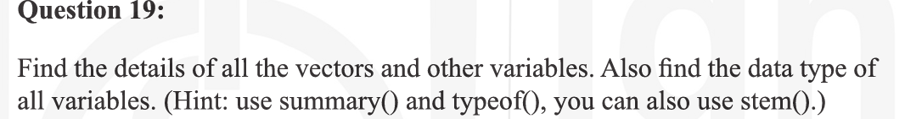

## Question-1

```
x = c(5, 7, 9, 11, 13, 13, 11, 9, 7, 5)
sum(x)
mean(x)
max(x)
min(x)
length(x)
var(x)
sd(x)
sort(x,decreasing = TRUE)
```


## Question-2


```
even_numbers <- seq(2, by = 2, length.out = 50)
descending_numbers <- 30:1

even_numbers
descending_numbers
```


## Question-3


```
for (i in 1:10){
  if(i==5 || i==7){
    next
  }
  vector1[i]=i
}
vector1
is.na(vector1)
```


## Question-4


```
```

## Question-5


## Question-6


## Question-7


## Question-8


## Question-9


## Question-10


## Question-11


## Question-12


## Question-13


## Question-14


## Question-15


## Question-16


## Question-17


## Question-18


## Question-19


## Question-20


## Question-21


## Question-22


## Question-23


## Question-24


## Question-25


## Question-26


## Question-27


## Question-28


## Question-29


## Question-30


## Question-31
