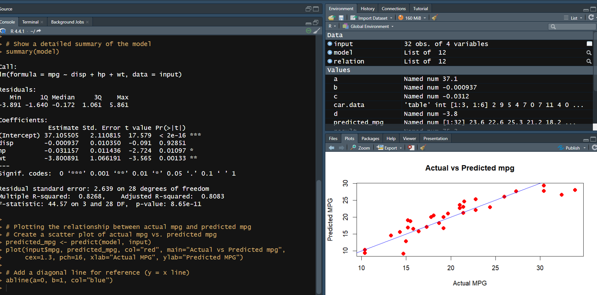

## Multiple Regression

```
# Load the dataset and select specific columns
input <- mtcars[, c("mpg", "disp", "hp", "wt")]

# Print the first few rows of the dataset
print(head(input))

# Create the relationship model
model <- lm(mpg ~ disp + hp + wt, data = input)

# Show the model
print(model)

# Get the Intercept and coefficients as vector elements
cat("### The Coefficient Values ###\n")
a <- coef(model)[1]
b <- coef(model)[2]
c <- coef(model)[3]
d <- coef(model)[4]
cat("Intercept:", a, "\n")
cat("disp:", b, "\n")
cat("hp:", c, "\n")
cat("wt:", d, "\n")

# Show a detailed summary of the model
summary(model)
```

