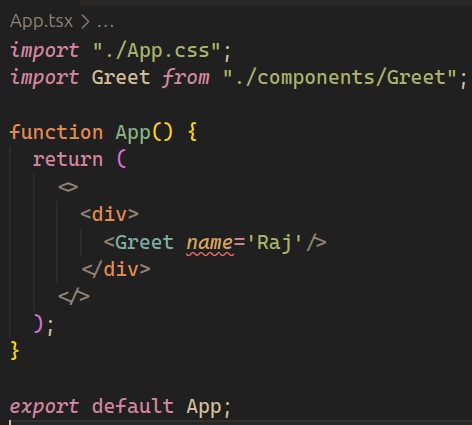
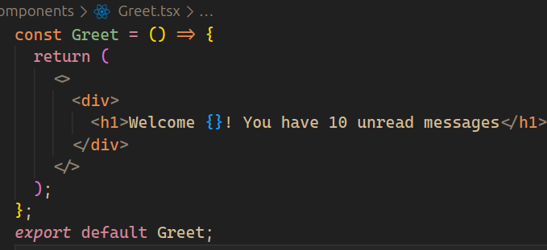
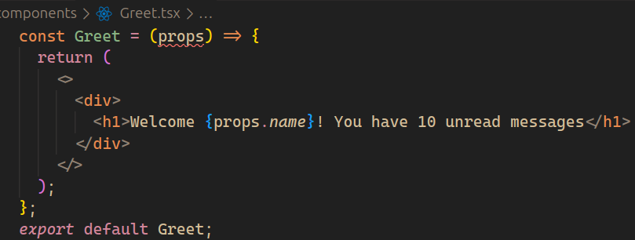
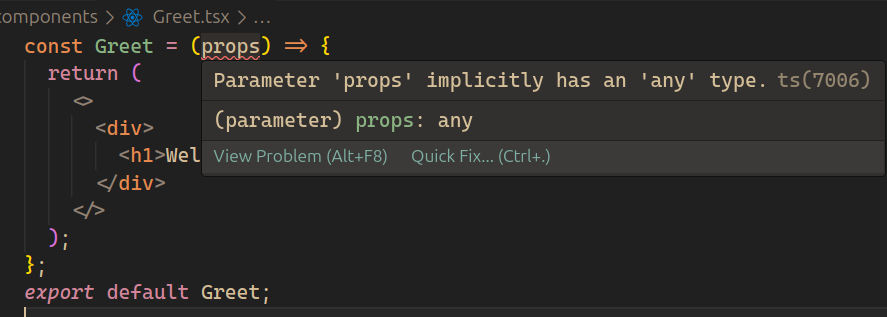
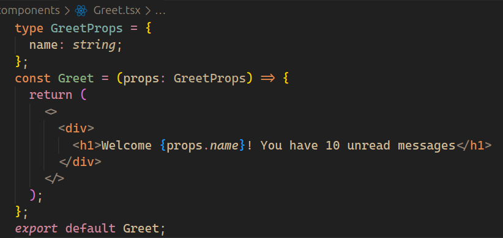
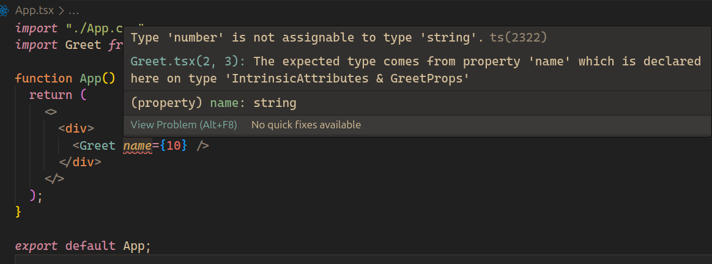
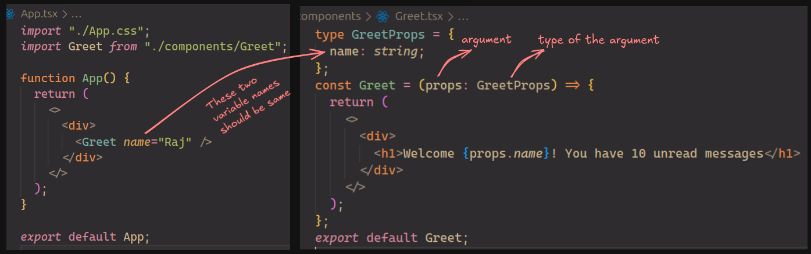

- ***`App.tsx`*** and ***`Greet.tsx`***
	-  In this we are trying to render Greet component with name prop but as we have not defined that Greet will accept props, We get red squiggly line.

	 
	
	
- Now, in ***`Greet.tsx`*** we define props. Now we get red squiggly line on props argument. Because it is of 'any' type.

    
     
     
- We are using typescript to avoid these. We don't want a component to accept 'any' type. Then there will be no difference between JS and TS.
- So, let's define type for our props.

- ***`Greet.tsx`***

  
  
- Now if we pass a number or any other data type other than TS will show error that you can't do that.
  
  

- ***type***:While building apps
- ***interface***:while building libraries